Analysis of Measles data in Germany
================
16 July, 2019

# Introduction and notes

  - This file contains figures and analyses presented in \`\`Ecological
    inference for infectious disease data, with application to
    vaccination strategies", along with additional analyses that are not
    discussed in detail in the primary manuscript.
  - There are three MCMC’s run through Stan in this analysis, each may
    take approximately 30 minutes to compile.

# Descriptive tables and figures

## Measles cases and estimated vaccination coverage

Number of measles cases and estimated vaccination coverage for the 16
German states from 2005-2007. MMR1 (MMR2) is the estimated vaccination
coverage for at least 1 (2) MMR vaccine, estimated from the school entry
examinations. Note this partially reproduces Table 1 from Herzog et al
2011.

``` 
                                State Population Total.Cases  MMR1  MMR2
1             Baden-Wuerttemberg (BW) 10,738,753         162 90.0% 75.6%
2                        Bavaria (BY) 12,492,658         606 88.7% 73.2%
3                         Berlin (BE)  3,404,037         104 90.0% 80.2%
4                    Brandenburg (BB)  2,547,772          18 93.9% 86.9%
5                         Bremen (HB)    663,979           4 88.4% 71.9%
6                        Hamburg (HH)  1,754,182          29 90.0% 80.5%
7                          Hesse (HE)  6,075,359         336 91.2% 78.1%
8  Mecklenburg-Western Pomerania (MV)  1,693,754           4 93.6% 88.0%
9                   Lower Saxony (NI)  7,982,685         144 91.2% 78.0%
10        North Rhine-Westphalia (NW) 18,028,745       2,036 89.7% 76.9%
11          Rhineland-Palatinate (RP)  4,052,860          85 90.8% 77.3%
12                      Saarland (SL)  1,043,167           0 91.0% 81.8%
13                        Saxony (SN)  4,249,774          18 94.3% 82.4%
14                 Saxony-Anhalt (ST)  2,441,787          12 94.1% 86.5%
15            Schleswig-Holstein (SH)  2,834,254          89 89.9% 79.3%
16                     Thuringia (TH)  2,311,140           8 94.8% 85.9%
```

## Summary figures

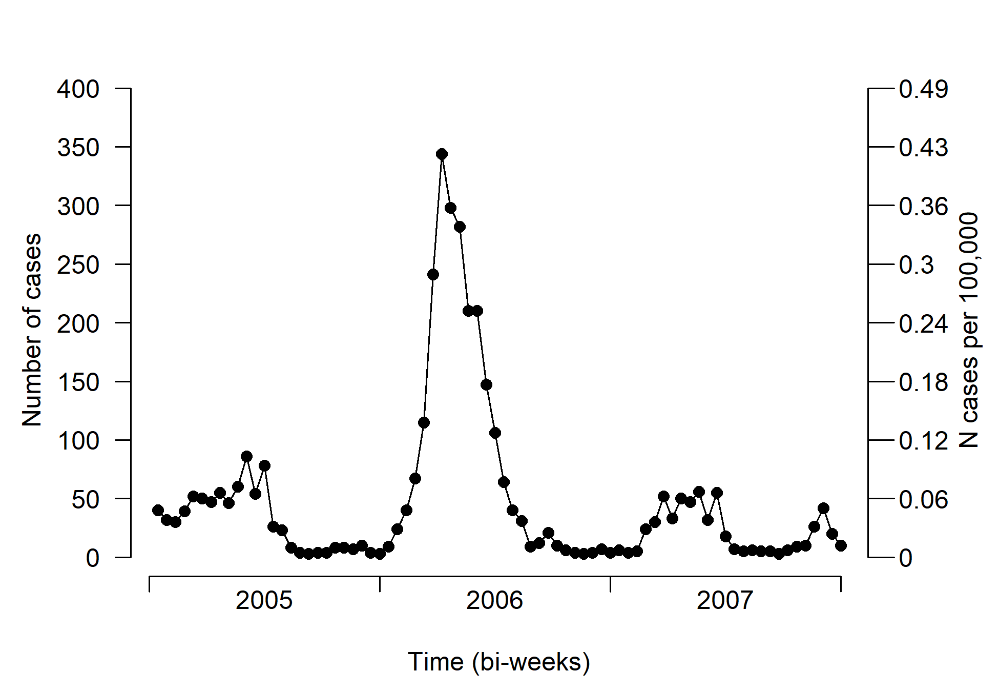


## Maps of the estimated proportion of individuals with at least one and two MMR vaccines.

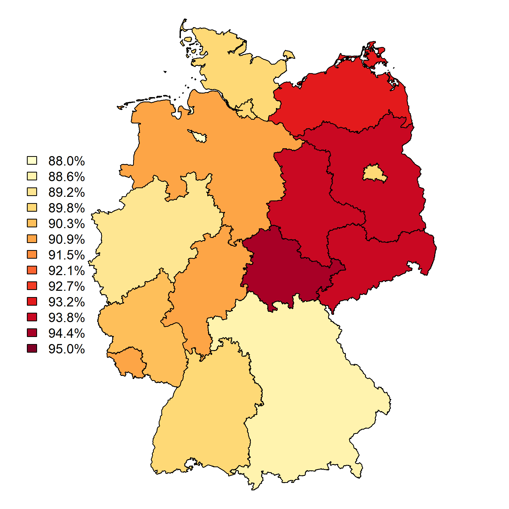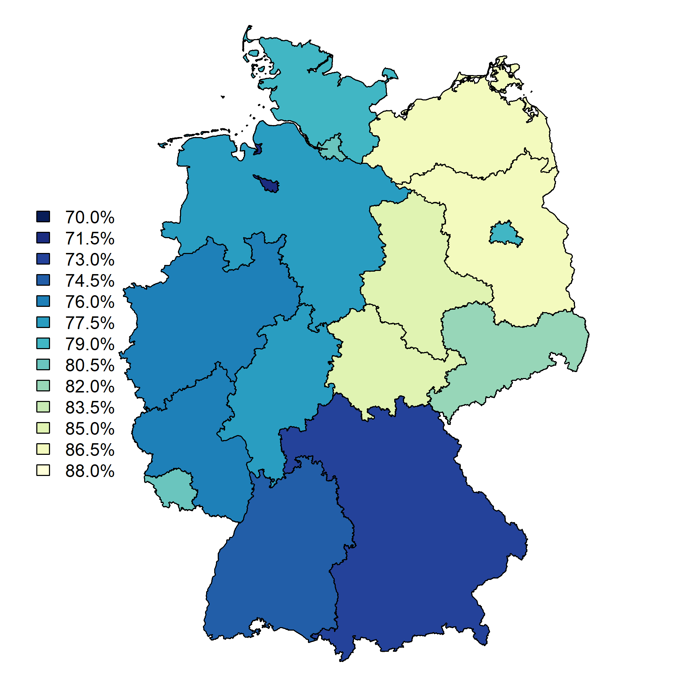

## Observed bi-weekly incidence of reported cases:

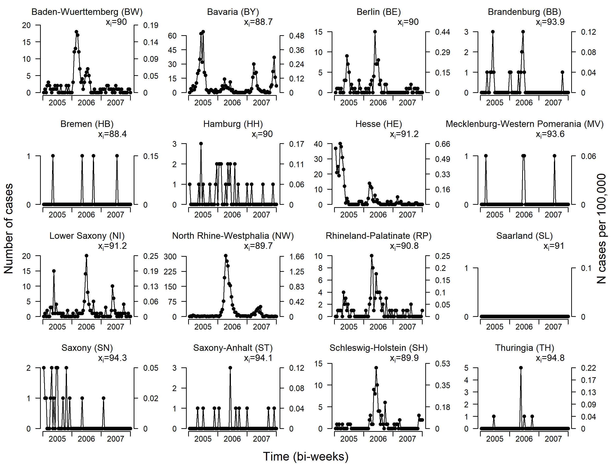

# Fit hierarchical model in Stan

## Get prior

``` r
priorch <- function(x,q1,q2,p1,p2){
  (p1-pbeta(q1,x[1],x[2]))^2 + (p2-pbeta(q2,x[1],x[2]))^2 }
# p1 and p2 define the upper and lower levels of the interval
p1 <- 0.05; p2 <- 0.95 
# q1 and q2 define the bounds of the interval
q1 <- 0.6; q2 <- 0.95 
## together, we interpret these values to say:
## we want 90% (p2-p1) of the mass to be between q1 and q2

## solve and get the parameters for a beta distribution 90% of mass between 0.6 and 0.95
opt <- optim(par=c(1,1),fn=priorch,q1=q1,q2=q2,p1=p1,p2=p2)
opt$par
```

    [1] 10.004052  2.449006

## Fit model and assess converged

``` r
measlesdat=list(I=16, # number of areas
                Ts=78, # number of time points
                Nobs=16*78, # total number of observations
                sin1=sin3, cos1=cos3, # inputs for seasonal terms
                y=t(Y), # observed cases dim I x Ts
                logNi=log(pop/sum(pop)), # log pop fraction
                X=X1, # vaccination coverage
                N=sum(pop), # total pop
                a=c(10, 2.5) # parameters specifying prior on phi
                ) 


pmt=proc.time()
fit <- stan(
        model_code = mod_ENre,
        chains=4, iter=4e3, 
        control=list(adapt_delta=0.99, max_treedepth = 15),
        seed=47,
        data = measlesdat)
(proc.time()-pmt)/60
```

``` 
       user      system     elapsed 
 0.49150000  0.03666667 28.37733333 
```

``` r
print(fit, pars=c("alpha_ar", "phi",  'alpha_en', 'gamma', 'delta', 'sigma_ar', 'sigma_en', "lp__"), probs=c(.025,.5,.975)) # 
```

    Inference for Stan model: c4c1ff19f358c6c9ee8fb5649733aef4.
    4 chains, each with iter=4000; warmup=2000; thin=1; 
    post-warmup draws per chain=2000, total post-warmup draws=8000.
    
                mean se_mean   sd    2.5%     50%   97.5% n_eff Rhat
    alpha_ar    0.83    0.01 0.50   -0.26    0.89    1.65  1185    1
    phi         0.89    0.00 0.09    0.66    0.91    0.99  2411    1
    alpha_en    3.46    0.01 0.43    2.55    3.51    4.15  1815    1
    gamma       0.71    0.00 0.08    0.55    0.71    0.86  8314    1
    delta      -0.20    0.00 0.08   -0.36   -0.20   -0.04  8890    1
    sigma_ar    0.74    0.01 0.35    0.28    0.68    1.58   948    1
    sigma_en    0.54    0.00 0.17    0.28    0.52    0.94  2121    1
    lp__     8516.04    0.16 5.56 8504.34 8516.32 8526.23  1217    1
    
    Samples were drawn using NUTS(diag_e) at Tue Jul 16 09:59:01 2019.
    For each parameter, n_eff is a crude measure of effective sample size,
    and Rhat is the potential scale reduction factor on split chains (at 
    convergence, Rhat=1).

``` r
print(fit, pars=c("alpha_ar", 're_ar', 'sigma_ar', "lp__"), probs=c(.025,.5,.975)) # 
```

    Inference for Stan model: c4c1ff19f358c6c9ee8fb5649733aef4.
    4 chains, each with iter=4000; warmup=2000; thin=1; 
    post-warmup draws per chain=2000, total post-warmup draws=8000.
    
                 mean se_mean   sd    2.5%     50%   97.5% n_eff Rhat
    alpha_ar     0.83    0.01 0.50   -0.26    0.89    1.65  1185 1.00
    re_ar[1]     0.44    0.01 0.31   -0.06    0.40    1.20  1003 1.01
    re_ar[2]     0.56    0.01 0.31    0.09    0.52    1.30   919 1.01
    re_ar[3]     0.32    0.01 0.32   -0.20    0.28    1.06   979 1.01
    re_ar[4]     0.31    0.01 0.44   -0.51    0.28    1.23  2219 1.00
    re_ar[5]    -0.62    0.01 0.70   -2.28   -0.50    0.45  3574 1.00
    re_ar[6]    -0.79    0.01 0.55   -2.09   -0.71    0.03  3393 1.00
    re_ar[7]     0.66    0.01 0.30    0.20    0.61    1.37   938 1.01
    re_ar[8]    -0.26    0.01 0.65   -1.74   -0.20    0.85  4525 1.00
    re_ar[9]     0.21    0.01 0.32   -0.32    0.18    0.97  1102 1.01
    re_ar[10]    0.77    0.01 0.30    0.32    0.73    1.49   897 1.01
    re_ar[11]    0.21    0.01 0.34   -0.37    0.17    0.98  1172 1.01
    re_ar[12]    0.02    0.01 0.84   -1.63    0.00    1.76  5310 1.00
    re_ar[13]   -0.43    0.01 0.54   -1.71   -0.38    0.46  4679 1.00
    re_ar[14]   -0.92    0.01 0.69   -2.57   -0.81    0.10  2560 1.00
    re_ar[15]    0.39    0.01 0.33   -0.15    0.34    1.14  1089 1.01
    re_ar[16]   -0.74    0.01 0.70   -2.40   -0.63    0.32  2898 1.00
    sigma_ar     0.74    0.01 0.35    0.28    0.68    1.58   948 1.00
    lp__      8516.04    0.16 5.56 8504.34 8516.32 8526.23  1217 1.00
    
    Samples were drawn using NUTS(diag_e) at Tue Jul 16 09:59:01 2019.
    For each parameter, n_eff is a crude measure of effective sample size,
    and Rhat is the potential scale reduction factor on split chains (at 
    convergence, Rhat=1).

``` r
print(fit, pars=c("alpha_en", 're_en', 'sigma_en', "lp__"), probs=c(.025,.5,.975)) # 
```

    Inference for Stan model: c4c1ff19f358c6c9ee8fb5649733aef4.
    4 chains, each with iter=4000; warmup=2000; thin=1; 
    post-warmup draws per chain=2000, total post-warmup draws=8000.
    
                 mean se_mean   sd    2.5%     50%   97.5% n_eff Rhat
    alpha_en     3.46    0.01 0.43    2.55    3.51    4.15  1815    1
    re_en[1]    -0.25    0.00 0.22   -0.69   -0.25    0.18  3052    1
    re_en[2]     0.34    0.00 0.22   -0.09    0.33    0.80  2304    1
    re_en[3]     0.58    0.00 0.25    0.10    0.57    1.08  2665    1
    re_en[4]    -0.31    0.00 0.33   -1.00   -0.30    0.29  4845    1
    re_en[5]    -0.10    0.00 0.36   -0.84   -0.09    0.59  7000    1
    re_en[6]     0.61    0.01 0.28    0.07    0.60    1.17  2769    1
    re_en[7]     0.00    0.00 0.25   -0.48    0.01    0.50  3735    1
    re_en[8]    -0.55    0.01 0.39   -1.39   -0.52    0.12  5261    1
    re_en[9]     0.37    0.00 0.22   -0.05    0.37    0.82  2502    1
    re_en[10]   -0.01    0.00 0.21   -0.41   -0.01    0.42  2462    1
    re_en[11]    0.45    0.00 0.25   -0.03    0.45    0.96  2909    1
    re_en[12]   -0.84    0.01 0.50   -1.99   -0.78   -0.05  3866    1
    re_en[13]   -0.40    0.00 0.29   -1.00   -0.40    0.13  4539    1
    re_en[14]   -0.03    0.00 0.28   -0.60   -0.02    0.52  5033    1
    re_en[15]    0.50    0.01 0.26   -0.01    0.49    1.02  2777    1
    re_en[16]   -0.24    0.00 0.32   -0.88   -0.23    0.36  5489    1
    sigma_en     0.54    0.00 0.17    0.28    0.52    0.94  2121    1
    lp__      8516.04    0.16 5.56 8504.34 8516.32 8526.23  1217    1
    
    Samples were drawn using NUTS(diag_e) at Tue Jul 16 09:59:01 2019.
    For each parameter, n_eff is a crude measure of effective sample size,
    and Rhat is the potential scale reduction factor on split chains (at 
    convergence, Rhat=1).

``` r
traceplot(fit, pars=c("alpha_ar", "phi",  'alpha_en', 'gamma', 'delta','sigma_ar', 'sigma_en', "lp__")) #
```


``` r
pairs(fit, pars=c("alpha_ar", "phi",  'alpha_en', 'gamma', 'delta', 'sigma_ar', 'sigma_en', "lp__")) #
```

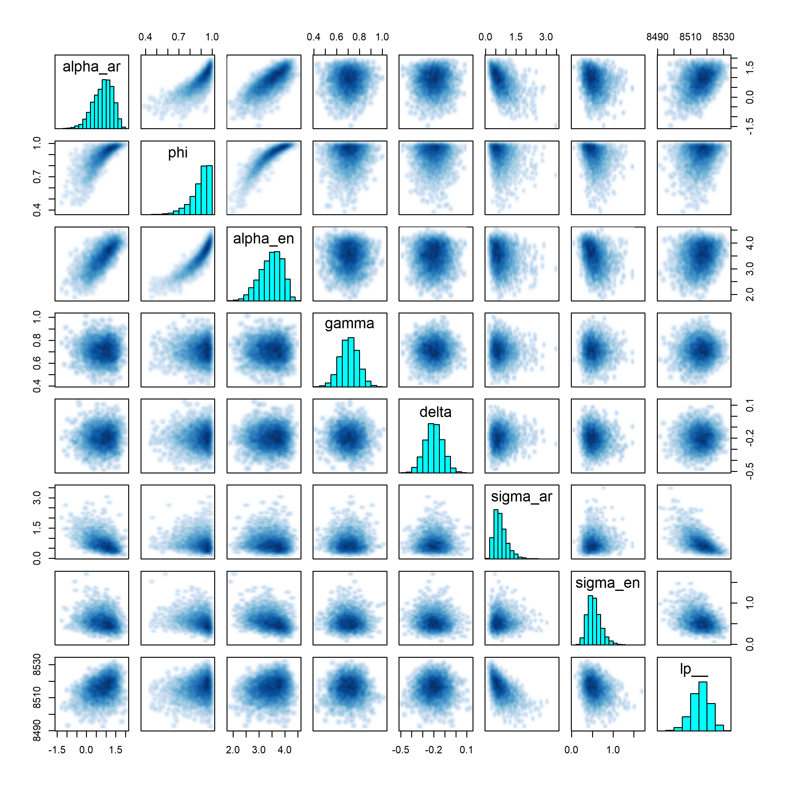

## Parameter estimates

``` 
            50%   2.5%  97.5%
alpha_ar  0.891 -0.255  1.649
phi       0.914  0.661  0.989
alpha_en  3.508  2.554  4.153
gamma     0.708  0.549  0.861
delta    -0.200 -0.357 -0.042
sigma_ar  0.675  0.279  1.575
sigma_en  0.522  0.281  0.942
R0        2.437  0.775  5.200
```

## Examine model fits

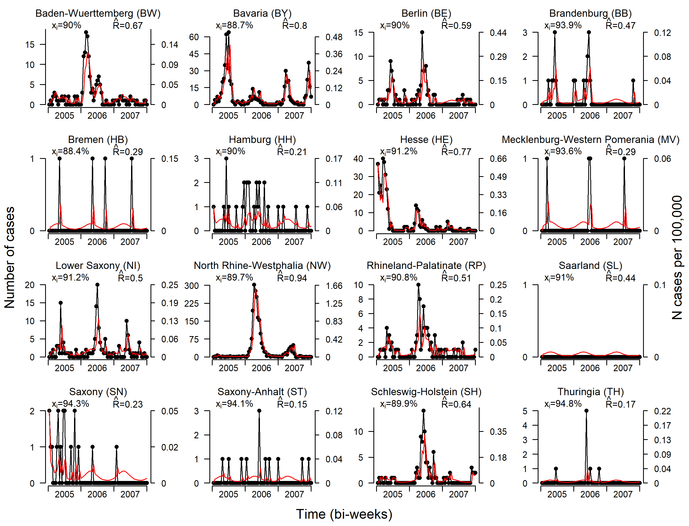

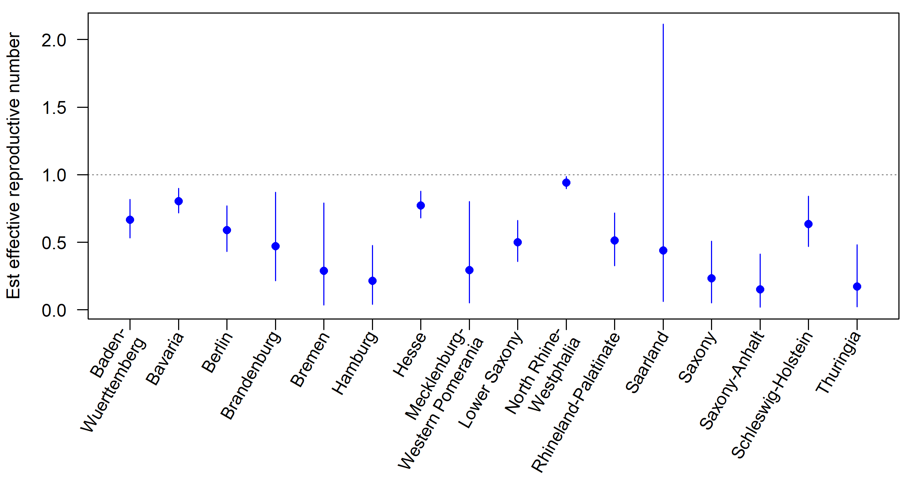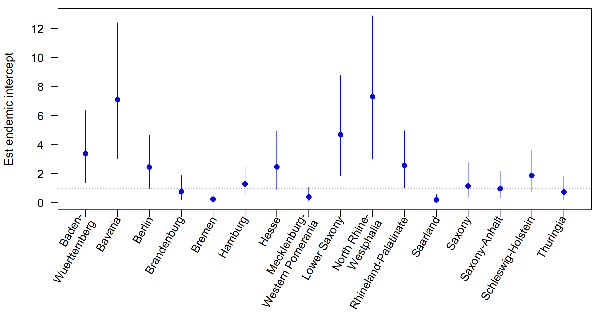

## Estimates of random effects

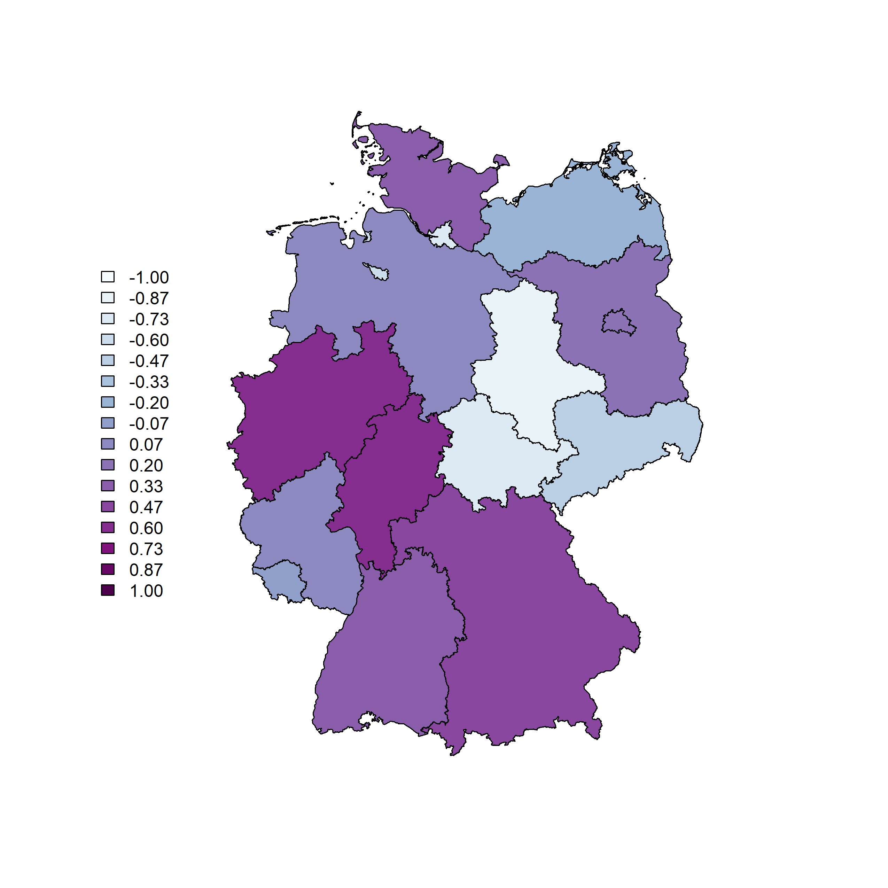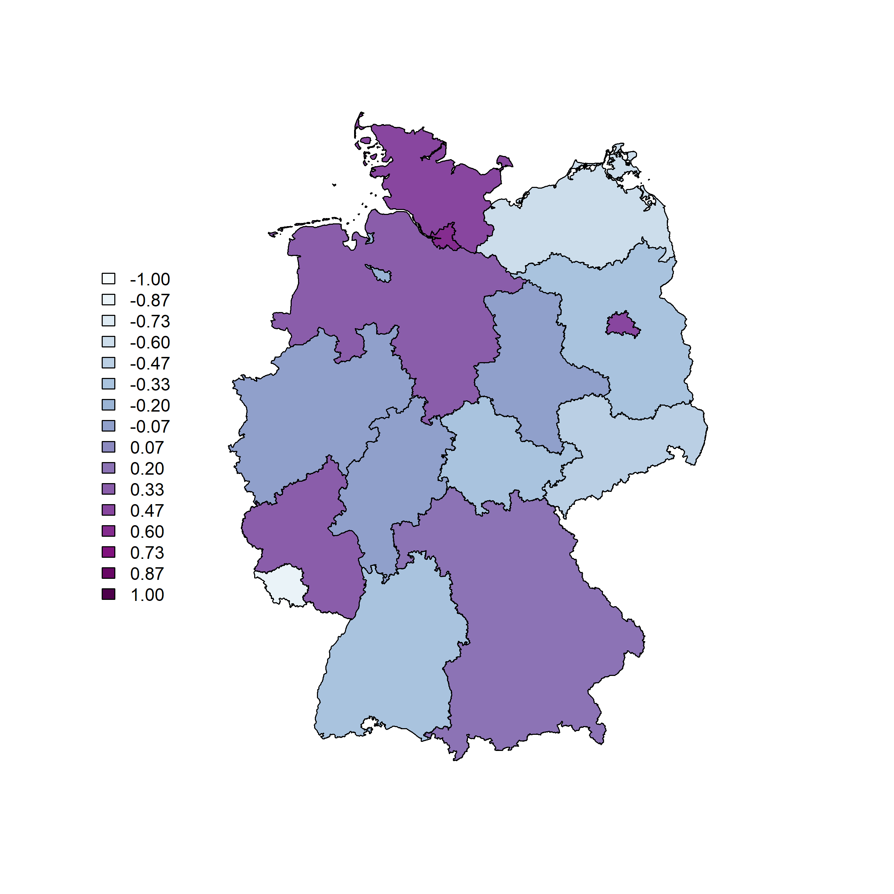

## Examine posterior distributions

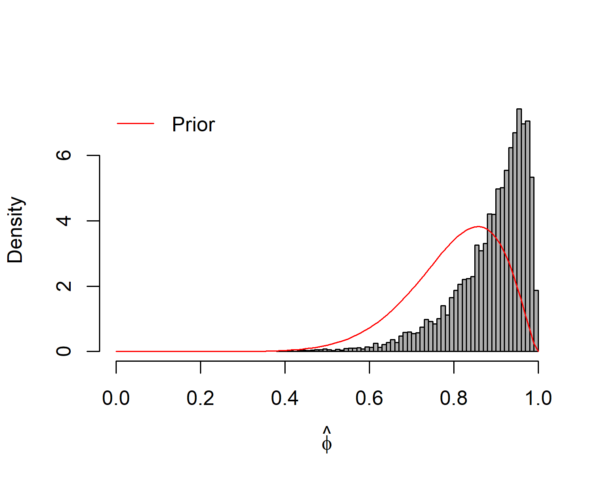

## Plot Pearson residuals

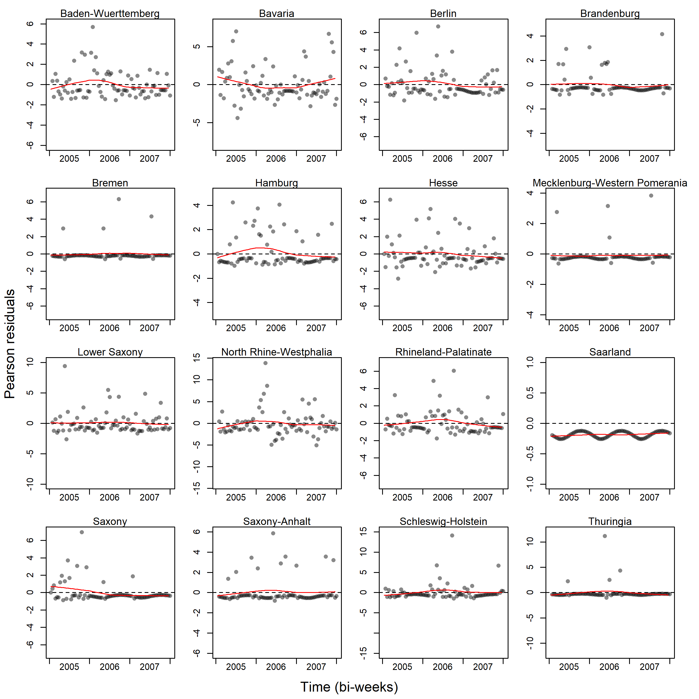

# Additional analyses

## Comparison of MLE vs Bayesian analysis

### MLE estimates

``` r
loglik_eco=function(param, y, xi, n){
        v=expit(param[2])
        l=0
        nwks=dim(y)[2]
        ni=dim(y)[1]
        for(i in 1:ni){
                for(t in 2:nwks){
                        lam=(exp(param[1])*y[i, t-1] + (n[i]/sum(n))*exp(param[3] + param[4]*sin(2*pi*t/26) + param[5]*cos(2*pi*t/26))  )
                        l=l-dpois(y[i, t], lambda=(1-v*xi[i])*lam, log=T)
                }
        }
        return(l)
}
```

``` 
  parameter         Est         SE
1  alpha_ar  2.02928493 0.07239919
2       phi  0.98867494 0.68640739
3  alpha_en  4.06273036 0.10100270
4     gamma  0.69281062 0.08418688
5     delta -0.07449201 0.08120128
```

### Estimates from fixed effects Stan model

``` r
measlesdat2=measlesdat
measlesdat2$a=c(1, 1) # put a flat prior on phi

pmt=proc.time()
fit_fe <- stan(
        model_code = mod_fe,
        chains=4, iter=4e3, # warmup = 1e3, # save_dso = T,  # warmup=7e3, # refresh=F, #  #
        control=list(adapt_delta=0.99, max_treedepth = 15),
        data = measlesdat2)
(proc.time()-pmt)/60
```

``` 
      user     system    elapsed 
0.42033333 0.02583333 8.41350000 
```

``` r
print(fit_fe, pars=c("alpha_ar", "phi",  'alpha_en', 'gamma', 'delta'), probs=c(.025,.5,.975), digits_summary = 3) # 
```

    Inference for Stan model: 8a16ff8514700ac19fc4f3422c38a24a.
    4 chains, each with iter=4000; warmup=2000; thin=1; 
    post-warmup draws per chain=2000, total post-warmup draws=8000.
    
               mean se_mean    sd   2.5%    50% 97.5% n_eff  Rhat
    alpha_ar  2.067   0.001 0.054  1.928  2.080 2.140  2297 1.001
    phi       0.994   0.000 0.006  0.976  0.996 1.000  2085 1.001
    alpha_en  4.121   0.002 0.084  3.927  4.128 4.264  2979 1.000
    gamma     0.700   0.001 0.084  0.534  0.700 0.866  4364 1.001
    delta    -0.073   0.001 0.080 -0.228 -0.074 0.091  4104 1.001
    
    Samples were drawn using NUTS(diag_e) at Tue Jul 16 10:09:18 2019.
    For each parameter, n_eff is a crude measure of effective sample size,
    and Rhat is the potential scale reduction factor on split chains (at 
    convergence, Rhat=1).

## Sensitivity analysis - measles analysis with non-informative priors

``` r
measlesdat=list(I=16, # number of areas
                Ts=78, # number of time points
                Nobs=16*78, # total number of observations
                sin1=sin3, cos1=cos3, # inputs for seasonal terms
                y=t(Y), # observed cases dim I x Ts
                logNi=log(pop/sum(pop)), # log pop fraction
                X=X1, # vaccination coverage
                N=sum(pop), # total pop
                a=c(1, 1) # parameters specifying prior on phi
                ) 


pmt=proc.time()
fit_flat <- stan(
        model_code = mod_ENre,
        chains=4, iter=4e3, # warmup = 1e3, # save_dso = T,  # warmup=7e3, # refresh=F, #  #
        control=list(adapt_delta=0.99, max_treedepth = 15),
        data = measlesdat)
(proc.time()-pmt)/60
```

``` 
       user      system     elapsed 
 0.37366667  0.03566667 41.98533333 
```

``` r
print(fit_flat, pars=c("alpha_ar", "phi",  'alpha_en', 'gamma', 'delta', 'sigma_ar', 'sigma_en', "lp__"), probs=c(.025,.5,.975)) # 
```

    Inference for Stan model: c4c1ff19f358c6c9ee8fb5649733aef4.
    4 chains, each with iter=4000; warmup=2000; thin=1; 
    post-warmup draws per chain=2000, total post-warmup draws=8000.
    
                mean se_mean   sd    2.5%     50%   97.5% n_eff Rhat
    alpha_ar    0.92    0.03 0.77   -0.90    1.18    1.83   739    1
    phi         0.86    0.01 0.23    0.15    0.96    1.00  1043    1
    alpha_en    3.54    0.02 0.73    1.79    3.82    4.33   876    1
    gamma       0.71    0.00 0.08    0.55    0.71    0.87  7345    1
    delta      -0.20    0.00 0.08   -0.35   -0.19   -0.03  6391    1
    sigma_ar    0.73    0.01 0.38    0.25    0.65    1.66   727    1
    sigma_en    0.52    0.01 0.19    0.23    0.50    0.96  1293    1
    lp__     8521.09    0.23 6.47 8507.85 8521.21 8532.78   793    1
    
    Samples were drawn using NUTS(diag_e) at Tue Jul 16 10:52:05 2019.
    For each parameter, n_eff is a crude measure of effective sample size,
    and Rhat is the potential scale reduction factor on split chains (at 
    convergence, Rhat=1).

``` r
print(fit_flat, pars=c("alpha_ar", 're_ar', 'sigma_ar', "lp__"), probs=c(.025,.5,.975)) # 
```

    Inference for Stan model: c4c1ff19f358c6c9ee8fb5649733aef4.
    4 chains, each with iter=4000; warmup=2000; thin=1; 
    post-warmup draws per chain=2000, total post-warmup draws=8000.
    
                 mean se_mean   sd    2.5%     50%   97.5% n_eff Rhat
    alpha_ar     0.92    0.03 0.77   -0.90    1.18    1.83   739    1
    re_ar[1]     0.40    0.01 0.31   -0.10    0.36    1.09   830    1
    re_ar[2]     0.51    0.01 0.31    0.04    0.47    1.20   721    1
    re_ar[3]     0.28    0.01 0.32   -0.23    0.25    0.99   942    1
    re_ar[4]     0.31    0.01 0.43   -0.50    0.30    1.21  2032    1
    re_ar[5]    -0.61    0.02 0.71   -2.32   -0.50    0.42  2025    1
    re_ar[6]    -0.80    0.01 0.56   -2.12   -0.71    0.01  1797    1
    re_ar[7]     0.63    0.01 0.29    0.19    0.59    1.29   843    1
    re_ar[8]    -0.24    0.01 0.65   -1.77   -0.18    0.85  4708    1
    re_ar[9]     0.19    0.01 0.31   -0.32    0.16    0.89  1070    1
    re_ar[10]    0.73    0.01 0.29    0.30    0.69    1.40   743    1
    re_ar[11]    0.19    0.01 0.33   -0.37    0.16    0.93  1089    1
    re_ar[12]    0.01    0.01 0.86   -1.72    0.00    1.79  4730    1
    re_ar[13]   -0.42    0.01 0.57   -1.73   -0.34    0.47  3027    1
    re_ar[14]   -0.91    0.02 0.75   -2.73   -0.77    0.14  1581    1
    re_ar[15]    0.35    0.01 0.32   -0.17    0.31    1.07   913    1
    re_ar[16]   -0.73    0.02 0.80   -2.65   -0.59    0.33  1240    1
    sigma_ar     0.73    0.01 0.38    0.25    0.65    1.66   727    1
    lp__      8521.09    0.23 6.47 8507.85 8521.21 8532.78   793    1
    
    Samples were drawn using NUTS(diag_e) at Tue Jul 16 10:52:05 2019.
    For each parameter, n_eff is a crude measure of effective sample size,
    and Rhat is the potential scale reduction factor on split chains (at 
    convergence, Rhat=1).

``` r
print(fit_flat, pars=c("alpha_en", 're_en', 'sigma_en', "lp__"), probs=c(.025,.5,.975)) # 
```

    Inference for Stan model: c4c1ff19f358c6c9ee8fb5649733aef4.
    4 chains, each with iter=4000; warmup=2000; thin=1; 
    post-warmup draws per chain=2000, total post-warmup draws=8000.
    
                 mean se_mean   sd    2.5%     50%   97.5% n_eff Rhat
    alpha_en     3.54    0.02 0.73    1.79    3.82    4.33   876    1
    re_en[1]    -0.27    0.00 0.23   -0.71   -0.27    0.19  2369    1
    re_en[2]     0.30    0.01 0.24   -0.14    0.29    0.81  1420    1
    re_en[3]     0.54    0.01 0.26    0.03    0.54    1.10  1770    1
    re_en[4]    -0.28    0.01 0.34   -0.99   -0.27    0.32  3715    1
    re_en[5]    -0.11    0.00 0.36   -0.86   -0.10    0.57  5233    1
    re_en[6]     0.57    0.01 0.29    0.04    0.56    1.17  1396    1
    re_en[7]     0.00    0.00 0.26   -0.50    0.00    0.52  3343    1
    re_en[8]    -0.53    0.01 0.39   -1.39   -0.49    0.14  3265    1
    re_en[9]     0.35    0.00 0.22   -0.07    0.34    0.82  2035    1
    re_en[10]   -0.03    0.01 0.22   -0.45   -0.04    0.42  1779    1
    re_en[11]    0.43    0.01 0.26   -0.04    0.42    0.96  1948    1
    re_en[12]   -0.81    0.01 0.50   -1.98   -0.75   -0.01  2799    1
    re_en[13]   -0.37    0.01 0.30   -0.97   -0.35    0.17  3210    1
    re_en[14]   -0.01    0.00 0.29   -0.60    0.00    0.56  4029    1
    re_en[15]    0.47    0.01 0.28   -0.04    0.46    1.04  1848    1
    re_en[16]   -0.20    0.01 0.33   -0.87   -0.18    0.40  3454    1
    sigma_en     0.52    0.01 0.19    0.23    0.50    0.96  1293    1
    lp__      8521.09    0.23 6.47 8507.85 8521.21 8532.78   793    1
    
    Samples were drawn using NUTS(diag_e) at Tue Jul 16 10:52:05 2019.
    For each parameter, n_eff is a crude measure of effective sample size,
    and Rhat is the potential scale reduction factor on split chains (at 
    convergence, Rhat=1).

``` r
traceplot(fit_flat, pars=c("alpha_ar", "phi",  'alpha_en', 'gamma', 'delta','sigma_ar', 'sigma_en', "lp__")) #
```

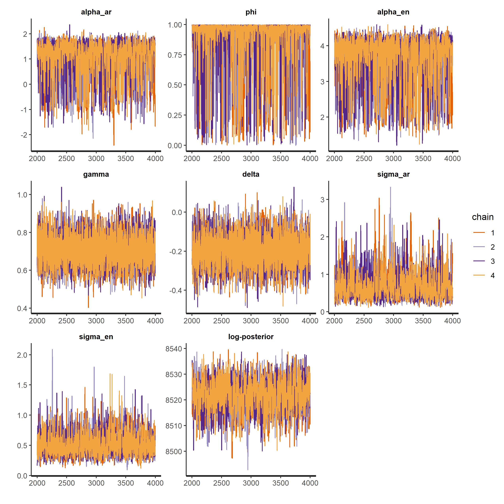

``` r
pairs(fit_flat, pars=c("alpha_ar", "phi",  'alpha_en', 'gamma', 'delta', 'sigma_ar', 'sigma_en', "lp__")) #
```

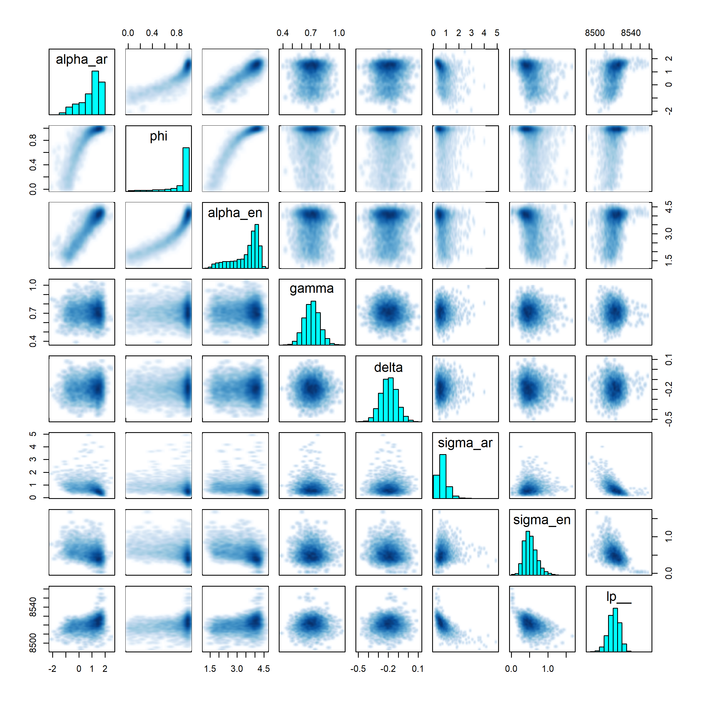

### Examine model fits

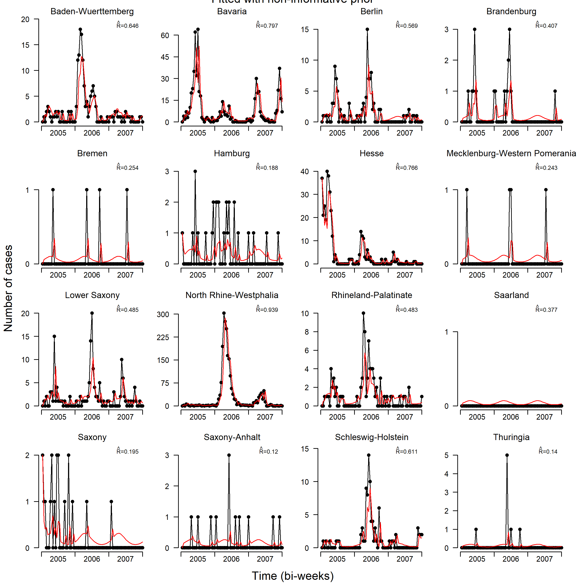

### Estimates of random effects

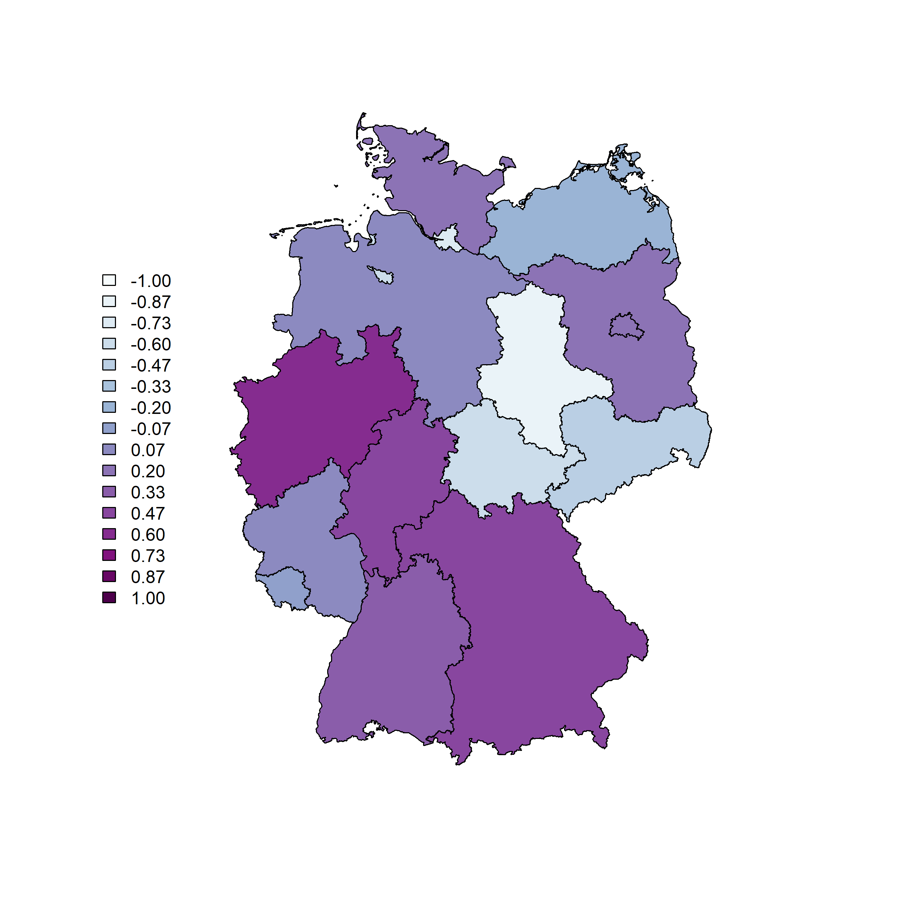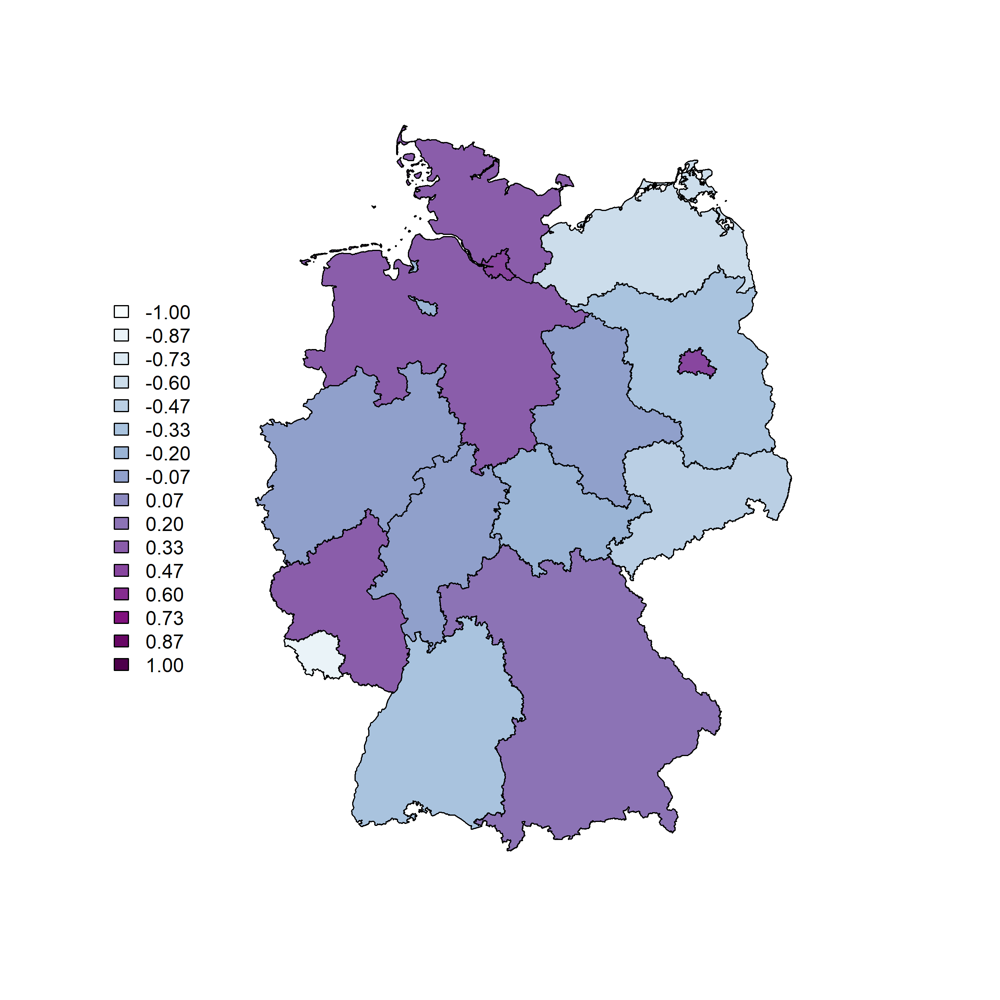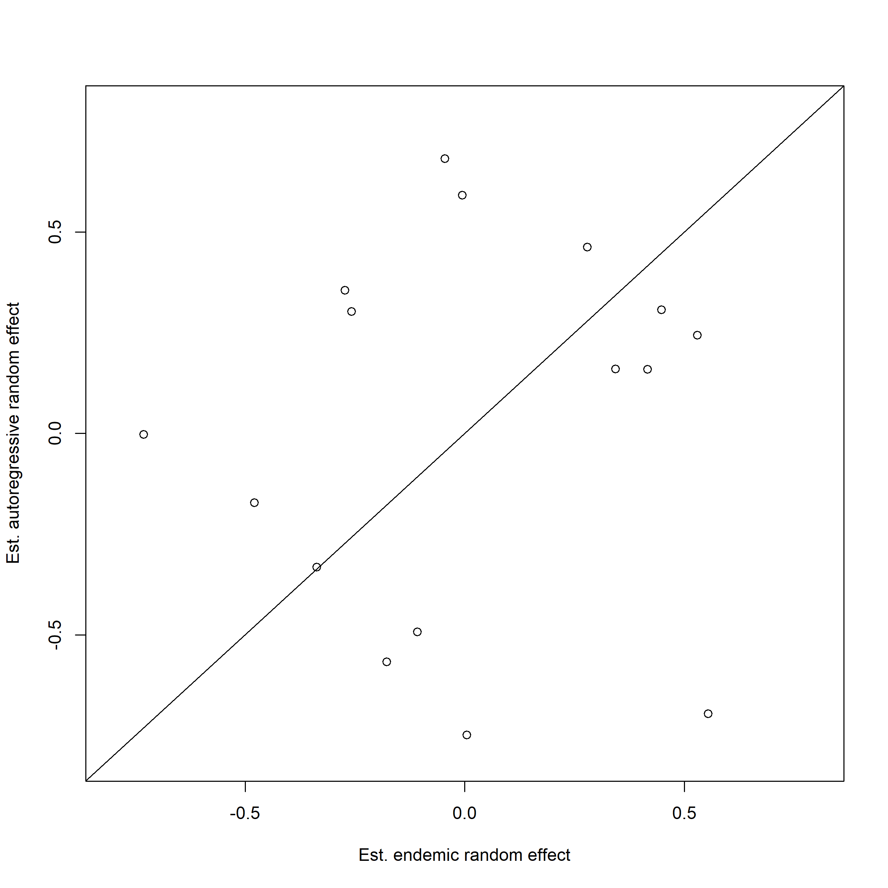

### Examine posterior distributions

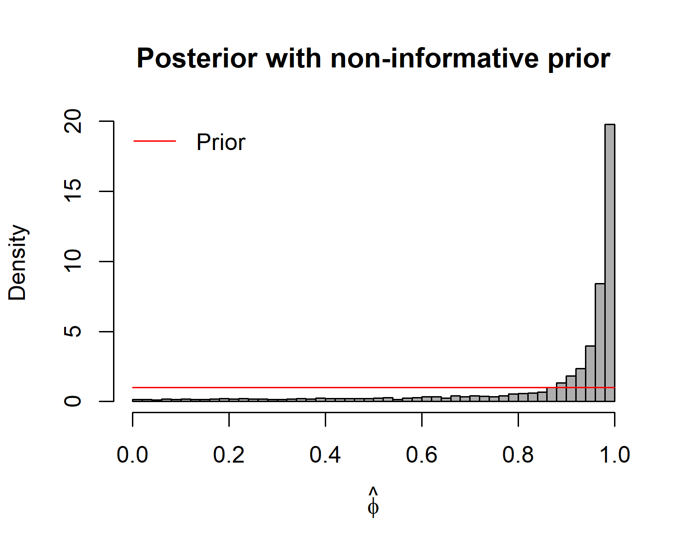

# Stan Models

Below, we print the code to define the Stan models fit in this document

``` r
mod_ENre='
data{
int<lower=1> I;          // number of areas
int<lower=1> Ts;         // number of times
int<lower=1> Nobs;    // number of total observations
int y[I, Ts] ;  // IxTs matrix of observations
real logNi[I];          // log population proportions 
vector[I] X;            // vector of Xi vacc cover
vector[Ts] sin1;           // vector of sin
vector[Ts] cos1;           // vector of cos
vector[2] a; //vector of parameters for the beta prior on phi
}
parameters{
real alpha_ar;  // AR component - intercept
real alpha_en;  // EN component - intercept
real gamma;     // sin component
real delta;     // cosine component 
real<lower=0, upper=1> phi;  // vaccine effect
vector[I] re_en; // EN random effects
vector[I] re_ar; // AR random effects
real<lower=0> sigma_ar; 
real<lower=0> sigma_en; 
}
model{
for(i in 1:I){
re_ar[i]~normal(0, sigma_ar);
re_en[i]~normal(0, sigma_en);
for(t in 2:Ts){
real muit;
muit = exp(alpha_ar+re_ar[i])*y[i, t-1] + exp(logNi[i] + alpha_en + re_en[i] + gamma*sin1[t] + delta*cos1[t]);
y[i, t] ~ poisson((1-phi*X[i])*muit);
}
}

//priors
alpha_ar ~ normal(0, 5);
alpha_en ~ normal(0, 5);
gamma ~ normal(0, 10);
delta ~ normal(0, 10);
phi ~ beta(a[1], a[2]);

}
generated quantities{
vector[Nobs-I] log_lik;
vector[I] ar;
vector[I] en;
vector[I] r; 
for(i in 1:I){
r[i] = exp(alpha_ar + re_ar[i])*(1-phi*X[i]); 
ar[i] = exp(alpha_ar + re_ar[i]);
en[i] = exp(alpha_en + re_en[i]);
for(t in 2:Ts){
real muit;
muit=exp(alpha_ar + re_ar[i])*y[i, t-1] + exp(logNi[i] + alpha_en + re_en[i] + gamma*sin1[t] + delta*cos1[t]);
log_lik[(i-1)*(Ts-1)+t-1 ] = poisson_lpmf(y[i, t] | (1-phi*X[i])*muit);
}
}
}
'

### fixed effects model - to the MLE 
mod_fe='
data{
int<lower=1> I;          // number of areas
int<lower=1> Ts;         // number of times
int<lower=1> Nobs;    // number of total observations
int y[I, Ts] ;  // IxTs matrix of observations
real logNi[I];          // log population sizes
vector[I] X;            // vector of Xi vacc cover
vector[Ts] sin1;           // vector of sin
vector[Ts] cos1;           // vector of cos
vector[2] a; //vector of parameters for the beta prior on phi
}
parameters{
real alpha_ar;  // AR component - intercept
real alpha_en;  // EN component - intercept
real gamma;     // sin component
real delta;     // cosine component 
real<lower=0, upper=1> phi;  // vaccine effect
}
model{
for(i in 1:I){
for(t in 2:Ts){
real muit;
muit = exp(alpha_ar)*y[i, t-1] + exp(logNi[i] + alpha_en + gamma*sin1[t] + delta*cos1[t]);
y[i, t] ~ poisson((1-phi*X[i])*muit);
}
}

//priors
alpha_ar ~ normal(0, 5);
alpha_en ~ normal(0, 5);
gamma ~ normal(0, 10);
delta ~ normal(0, 10);
phi ~ beta(a[1], a[2]);

}
generated quantities{
vector[Nobs-I] log_lik;
vector[I] ri; 
for(i in 1:I){
ri[i] = exp(alpha_ar)*(1-phi*X[i]); 
for(t in 2:Ts){
real muit;
muit=exp(alpha_ar)*y[i, t-1] + exp(logNi[i] + alpha_en + gamma*sin1[t] + delta*cos1[t]);
log_lik[(i-1)*(Ts-1)+t-1 ] = poisson_lpmf(y[i, t] | (1-phi*X[i])*muit);
}
}
}
'
```
