    


# Introduction and notes
- This file contains code and analysis for the simulations presented in ``Ecological inference for infectious disease data, with application to vaccination strategies". 
- All functions are found in ecofall_sim_functions.R
- This file may take up to an hour to compile. The slowest analysis is the asymptotic analysis. I have reduced the number of simulations for those analyses, and did not re-compile.

# Simulations to assess simplifying assumptions in the absence of vaccination {.tabset}

For all simulations in this section, we summarize results over 250 simulated populations, each with a population of 100,000 and we assume the endemic component, $\alpha_{EN}$, is -10. 

## $R_0$ = 2.5

```r
alpha_ar = log(2.5)
# 
set.seed(47)
sim_r0big=replicate(Nsims, sim.simple(N=N, Nwks=3*52, alpha_ar=alpha_ar, alpha_en=alpha_en))

vals=c(alpha_ar, alpha_en)

res_r0big = plyr::ldply(1:8, function(i){
        m = paste0('mod', i)
        
        est=sapply(sim_r0big[m, ], function(x){x$par})
        ests = rowMeans(est)
        se.ests = apply(est, 1, sd)
        percentiles = apply(est, 1, function(x){quantile(x, c(0.025, 0.975))})
        
        bias = rowMeans(sapply(sim_r0big[m, ], function(x){(x$par - vals)}))
        mse = rowMeans(sapply(sim_r0big[m, ], function(x){(x$par - vals)^2}))
        c(mod = i, Est.ar = ests[1], pct.025.ar = as.numeric(percentiles[1, 1]), pct.975.ar = as.numeric(percentiles[2, 1]), Bias.ar = bias[1], MSE.ar = mse[1], 
          Est.en = ests[2], pct.025.en = as.numeric(percentiles[1, 2]), pct.975.en = as.numeric(percentiles[2, 2]), Bias.en = bias[2], MSE.en = mse[2])

})
```

Examples of simulated epidemic curves when $R_0=2.5$
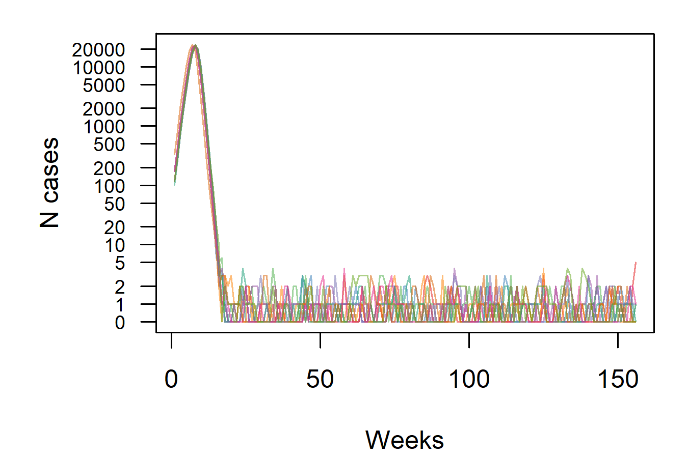


```r
# 
par(mfrow=c(2, 1), mar=c(3.75, 3, 0.5, 0.5)+0.15, oma=c(0.2, 1.5, 0, 0))
## Plots of estimates
rng.ar = range(res_r0big$Est.ar, res_r0big$pct.025.ar, res_r0big$pct.975.ar, alpha_ar)
        
plot(x=c(1, 8), y=rng.ar, type='n', xaxt='n', ylab='', xlab='', las=1) 
abline(h=alpha_ar, col='#ff0000')
mtext(expression(Est~ widehat(alpha[scriptscriptstyle(AR)])), side=2, line=3)
mtext(1, at=1:8, text=rep(c(expression(S[t-1]), 'N'), 4), line=0.1, cex=1)
axis(1, at=c(1, 2)+c(-0.15, 0.15), labels=rep('', 2), line=1.15, tck=0.01)
axis(1, at=c(3, 4)+c(-0.15, 0.15), labels=rep('', 2), line=1.15, tck=0.01)
axis(1, at=c(5, 6)+c(-0.15, 0.15), labels=rep('', 2), line=1.15, tck=0.01)
axis(1, at=c(7, 8)+c(-0.15, 0.15), labels=rep('', 2), line=1.15, tck=0.01)
mtext(1, at=seq(1.5, 8, by=2), text=rep(c(expression(1-e^lambda[t]), expression(lambda[t])), 2 ), line=1.75, cex=1.15)
axis(1, at=c(1, 4)+c(-0.2, 0.2), labels=rep('', 2), line=3, tck=0.05)
axis(1, at=c(5, 8)+c(-0.2, 0.2), labels=rep('', 2), line=3, tck=0.05)
mtext(1, at=c(2.5, 6.5), text=c('Binomial', 'Poisson'), line=3, cex=1)
points(x=1:8, y=res_r0big$Est.ar, pch=16)
for(i in 1:8){
        segments(x0=i, x1=i, y0=res_r0big$pct.025.ar[i], y1=res_r0big$pct.975.ar[i])
}

rng.en = range(res_r0big$Est.en, res_r0big$pct.025.en, res_r0big$pct.975.en, alpha_en)

plot(x=c(1, 8), y=rng.en, type='n', xaxt='n', ylab='', xlab='', las=1) 
abline(h=alpha_en, col='#ff0000')
mtext(expression(Est~widehat(alpha[scriptscriptstyle(EN)])), side=2, line=3)
mtext(1, at=1:8, text=rep(c(expression(S[t-1]), 'N'), 4), line=0.1, cex=1)
axis(1, at=c(1, 2)+c(-0.15, 0.15), labels=rep('', 2), line=1.15, tck=0.01)
axis(1, at=c(3, 4)+c(-0.15, 0.15), labels=rep('', 2), line=1.15, tck=0.01)
axis(1, at=c(5, 6)+c(-0.15, 0.15), labels=rep('', 2), line=1.15, tck=0.01)
axis(1, at=c(7, 8)+c(-0.15, 0.15), labels=rep('', 2), line=1.15, tck=0.01)
mtext(1, at=seq(1.5, 8, by=2), text=rep(c(expression(1-e^lambda[t]), expression(lambda[t])), 2 ), line=1.75, cex=1.15)
axis(1, at=c(1, 4)+c(-0.2, 0.2), labels=rep('', 2), line=3, tck=0.05)
axis(1, at=c(5, 8)+c(-0.2, 0.2), labels=rep('', 2), line=3, tck=0.05)
mtext(1, at=c(2.5, 6.5), text=c('Binomial', 'Poisson'), line=3, cex=1)
points(x=1:8, y=res_r0big$Est.en, pch=16)
for(i in 1:8){
        segments(x0=i, x1=i, y0=res_r0big$pct.025.en[i], y1=res_r0big$pct.975.en[i])
}


#### Plots of Bias
rng.ar = range(res_r0big$Bias.ar, 0)
        
plot(x=c(1, 8), y=rng.ar, type='n', xaxt='n', ylab='', xlab='', las=1) 
abline(h=0, col='#0000ff')
mtext(expression(Bias~ widehat(alpha[scriptscriptstyle(AR)])), side=2, line=3)
mtext(1, at=1:8, text=rep(c(expression(S[t-1]), 'N'), 4), line=0.1, cex=1)
axis(1, at=c(1, 2)+c(-0.15, 0.15), labels=rep('', 2), line=1.15, tck=0.01)
axis(1, at=c(3, 4)+c(-0.15, 0.15), labels=rep('', 2), line=1.15, tck=0.01)
axis(1, at=c(5, 6)+c(-0.15, 0.15), labels=rep('', 2), line=1.15, tck=0.01)
axis(1, at=c(7, 8)+c(-0.15, 0.15), labels=rep('', 2), line=1.15, tck=0.01)
mtext(1, at=seq(1.5, 8, by=2), text=rep(c(expression(1-e^lambda[t]), expression(lambda[t])), 2 ), line=1.75, cex=1.15)
axis(1, at=c(1, 4)+c(-0.2, 0.2), labels=rep('', 2), line=3, tck=0.05)
axis(1, at=c(5, 8)+c(-0.2, 0.2), labels=rep('', 2), line=3, tck=0.05)
mtext(1, at=c(2.5, 6.5), text=c('Binomial', 'Poisson'), line=3, cex=1)
points(x=1:8, y=res_r0big$Bias.ar, pch=16)

rng.en = range(res_r0big$Bias.en, 0)

plot(x=c(1, 8), y=rng.en, type='n', xaxt='n', ylab='', xlab='', las=1) 
abline(h=0, col='#0000ff')
mtext(expression(Bias~widehat(alpha[scriptscriptstyle(EN)])), side=2, line=3)
mtext(1, at=1:8, text=rep(c(expression(S[t-1]), 'N'), 4), line=0.1, cex=1)
axis(1, at=c(1, 2)+c(-0.15, 0.15), labels=rep('', 2), line=1.15, tck=0.01)
axis(1, at=c(3, 4)+c(-0.15, 0.15), labels=rep('', 2), line=1.15, tck=0.01)
axis(1, at=c(5, 6)+c(-0.15, 0.15), labels=rep('', 2), line=1.15, tck=0.01)
axis(1, at=c(7, 8)+c(-0.15, 0.15), labels=rep('', 2), line=1.15, tck=0.01)
mtext(1, at=seq(1.5, 8, by=2), text=rep(c(expression(1-e^lambda[t]), expression(lambda[t])), 2 ), line=1.75, cex=1.15)
axis(1, at=c(1, 4)+c(-0.2, 0.2), labels=rep('', 2), line=3, tck=0.05)
axis(1, at=c(5, 8)+c(-0.2, 0.2), labels=rep('', 2), line=3, tck=0.05)
mtext(1, at=c(2.5, 6.5), text=c('Binomial', 'Poisson'), line=3, cex=1)
points(x=1:8, y=res_r0big$Bias.en, pch=16)


rng.ar = range(res_r0big$MSE.ar, 0)
        
plot(x=c(1, 8), y=rng.ar, type='n', xaxt='n', ylab='', xlab='', las=1) 
abline(h=0, col='#0000ff')
mtext(expression(MSE~ widehat(alpha[scriptscriptstyle(AR)])), side=2, line=3)
mtext(1, at=1:8, text=rep(c(expression(S[t-1]), 'N'), 4), line=0.1, cex=1)
axis(1, at=c(1, 2)+c(-0.15, 0.15), labels=rep('', 2), line=1.15, tck=0.01)
axis(1, at=c(3, 4)+c(-0.15, 0.15), labels=rep('', 2), line=1.15, tck=0.01)
axis(1, at=c(5, 6)+c(-0.15, 0.15), labels=rep('', 2), line=1.15, tck=0.01)
axis(1, at=c(7, 8)+c(-0.15, 0.15), labels=rep('', 2), line=1.15, tck=0.01)
mtext(1, at=seq(1.5, 8, by=2), text=rep(c(expression(1-e^lambda[t]), expression(lambda[t])), 2 ), line=1.75, cex=1.15)
axis(1, at=c(1, 4)+c(-0.2, 0.2), labels=rep('', 2), line=3, tck=0.05)
axis(1, at=c(5, 8)+c(-0.2, 0.2), labels=rep('', 2), line=3, tck=0.05)
mtext(1, at=c(2.5, 6.5), text=c('Binomial', 'Poisson'), line=3, cex=1)
points(x=1:8, y=res_r0big$MSE.ar, pch=16)

rng.en = range(res_r0big$MSE.en, 0)

plot(x=c(1, 8), y=rng.en, type='n', xaxt='n', ylab='', xlab='', las=1) 
abline(h=0, col='#0000ff')
mtext(expression(MSE~widehat(alpha[scriptscriptstyle(EN)])), side=2, line=3)
mtext(1, at=1:8, text=rep(c(expression(S[t-1]), 'N'), 4), line=0.1, cex=1)
axis(1, at=c(1, 2)+c(-0.15, 0.15), labels=rep('', 2), line=1.15, tck=0.01)
axis(1, at=c(3, 4)+c(-0.15, 0.15), labels=rep('', 2), line=1.15, tck=0.01)
axis(1, at=c(5, 6)+c(-0.15, 0.15), labels=rep('', 2), line=1.15, tck=0.01)
axis(1, at=c(7, 8)+c(-0.15, 0.15), labels=rep('', 2), line=1.15, tck=0.01)
mtext(1, at=seq(1.5, 8, by=2), text=rep(c(expression(1-e^lambda[t]), expression(lambda[t])), 2 ), line=1.75, cex=1.15)
axis(1, at=c(1, 4)+c(-0.2, 0.2), labels=rep('', 2), line=3, tck=0.05)
axis(1, at=c(5, 8)+c(-0.2, 0.2), labels=rep('', 2), line=3, tck=0.05)
mtext(1, at=c(2.5, 6.5), text=c('Binomial', 'Poisson'), line=3, cex=1)
points(x=1:8, y=res_r0big$MSE.en, pch=16)
```

<div class="figure">
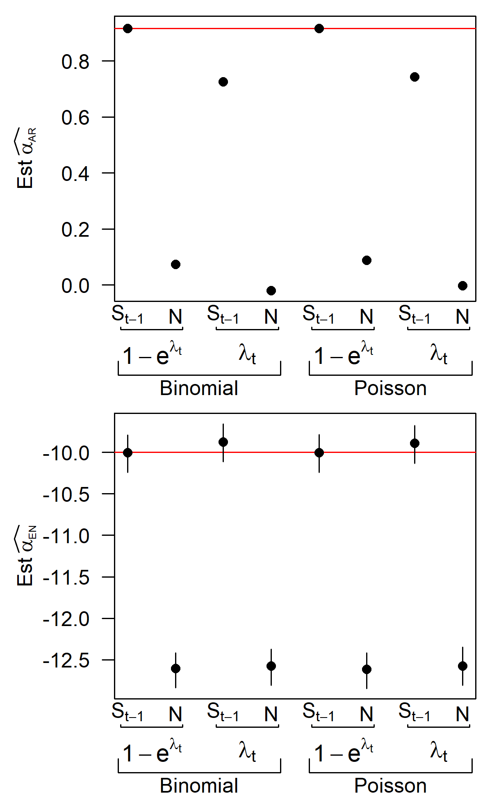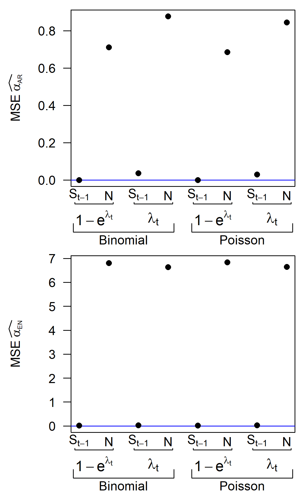
<p class="caption">Red lines indicate true parameter value; blue line is at zero.</p>
</div>


```r
# 
kable(res_r0big, caption=paste('Summary of parameter estimates from', Nsims, 'simulations, where alpha_ar =', sprintf('%.3f', alpha_ar), 'and alpha_en =', alpha_en ), digits=3)
```


Table: Summary of parameter estimates from 250 simulations, where alpha_ar = 0.916 and alpha_en = -10

 mod   Est.ar   pct.025.ar   pct.975.ar   Bias.ar   MSE.ar    Est.en   pct.025.en   pct.975.en   Bias.en   MSE.en
----  -------  -----------  -----------  --------  -------  --------  -----------  -----------  --------  -------
   1    0.916        0.910        0.923     0.000    0.000   -10.003      -10.244       -9.790    -0.003    0.014
   2    0.073        0.072        0.074    -0.843    0.711   -12.606      -12.839      -12.416    -2.606    6.802
   3    0.726        0.722        0.730    -0.191    0.036    -9.874      -10.115       -9.660     0.126    0.031
   4   -0.020       -0.021       -0.019    -0.936    0.877   -12.573      -12.806      -12.374    -2.573    6.632
   5    0.916        0.909        0.922     0.000    0.000   -10.003      -10.244       -9.785    -0.003    0.014
   6    0.089        0.087        0.091    -0.827    0.685   -12.612      -12.845      -12.417    -2.612    6.834
   7    0.743        0.739        0.747    -0.173    0.030    -9.890      -10.133       -9.678     0.110    0.027
   8   -0.002       -0.003       -0.001    -0.919    0.844   -12.576      -12.805      -12.346    -2.576    6.649


## $R_0 = 1$

```r
alpha_ar = log(1)

set.seed(47)
sim_r0mod=replicate(Nsims, sim.simple(N=N, Nwks=3*52, alpha_ar=alpha_ar, alpha_en=alpha_en))

vals=c(alpha_ar, alpha_en)

res_r0mod = plyr::ldply(1:8, function(i){
        m = paste0('mod', i)
        
        est=sapply(sim_r0mod[m, ], function(x){x$par})
        ests = rowMeans(est)
        se.ests = apply(est, 1, sd)
        percentiles = apply(est, 1, function(x){quantile(x, c(0.025, 0.975))})
        
        bias = rowMeans(sapply(sim_r0mod[m, ], function(x){(x$par - vals)}))
        mse = rowMeans(sapply(sim_r0mod[m, ], function(x){(x$par - vals)^2}))
        c(mod = i, Est.ar = ests[1], pct.025.ar = as.numeric(percentiles[1, 1]), pct.975.ar = as.numeric(percentiles[2, 1]), Bias.ar = bias[1], MSE.ar = mse[1], 
          Est.en = ests[2], pct.025.en = as.numeric(percentiles[1, 2]), pct.975.en = as.numeric(percentiles[2, 2]), Bias.en = bias[2], MSE.en = mse[2])

})
```

Examples of simulated epidemic curves when $R_0=1$


```r
par(mfrow=c(2, 1), mar=c(3.75, 3, 0.5, 0.5)+0.15, oma=c(0.2, 1.5, 0, 0))
## Plots of estimates
rng.ar = range(res_r0mod$Est.ar, res_r0mod$pct.025.ar, res_r0mod$pct.975.ar, alpha_ar)
        
plot(x=c(1, 8), y=rng.ar, type='n', xaxt='n', ylab='', xlab='', las=1) 
abline(h=alpha_ar, col='#ff0000')
mtext(expression(Est~ widehat(alpha[scriptscriptstyle(AR)])), side=2, line=3)
mtext(1, at=1:8, text=rep(c(expression(S[t-1]), 'N'), 4), line=0.1, cex=1)
axis(1, at=c(1, 2)+c(-0.15, 0.15), labels=rep('', 2), line=1.15, tck=0.01)
axis(1, at=c(3, 4)+c(-0.15, 0.15), labels=rep('', 2), line=1.15, tck=0.01)
axis(1, at=c(5, 6)+c(-0.15, 0.15), labels=rep('', 2), line=1.15, tck=0.01)
axis(1, at=c(7, 8)+c(-0.15, 0.15), labels=rep('', 2), line=1.15, tck=0.01)
mtext(1, at=seq(1.5, 8, by=2), text=rep(c(expression(1-e^lambda[t]), expression(lambda[t])), 2 ), line=1.75, cex=1.15)
axis(1, at=c(1, 4)+c(-0.2, 0.2), labels=rep('', 2), line=3, tck=0.05)
axis(1, at=c(5, 8)+c(-0.2, 0.2), labels=rep('', 2), line=3, tck=0.05)
mtext(1, at=c(2.5, 6.5), text=c('Binomial', 'Poisson'), line=3, cex=1)
points(x=1:8, y=res_r0mod$Est.ar, pch=16)
for(i in 1:8){
        segments(x0=i, x1=i, y0=res_r0mod$pct.025.ar[i], y1=res_r0mod$pct.975.ar[i])
}

rng.en = range(res_r0mod$Est.en, res_r0mod$pct.025.en, res_r0mod$pct.975.en, alpha_en)

plot(x=c(1, 8), y=rng.en, type='n', xaxt='n', ylab='', xlab='', las=1) 
abline(h=alpha_en, col='#ff0000')
mtext(expression(Est~widehat(alpha[scriptscriptstyle(EN)])), side=2, line=3)
mtext(1, at=1:8, text=rep(c(expression(S[t-1]), 'N'), 4), line=0.1, cex=1)
axis(1, at=c(1, 2)+c(-0.15, 0.15), labels=rep('', 2), line=1.15, tck=0.01)
axis(1, at=c(3, 4)+c(-0.15, 0.15), labels=rep('', 2), line=1.15, tck=0.01)
axis(1, at=c(5, 6)+c(-0.15, 0.15), labels=rep('', 2), line=1.15, tck=0.01)
axis(1, at=c(7, 8)+c(-0.15, 0.15), labels=rep('', 2), line=1.15, tck=0.01)
mtext(1, at=seq(1.5, 8, by=2), text=rep(c(expression(1-e^lambda[t]), expression(lambda[t])), 2 ), line=1.75, cex=1.15)
axis(1, at=c(1, 4)+c(-0.2, 0.2), labels=rep('', 2), line=3, tck=0.05)
axis(1, at=c(5, 8)+c(-0.2, 0.2), labels=rep('', 2), line=3, tck=0.05)
mtext(1, at=c(2.5, 6.5), text=c('Binomial', 'Poisson'), line=3, cex=1)
points(x=1:8, y=res_r0mod$Est.en, pch=16)
for(i in 1:8){
        segments(x0=i, x1=i, y0=res_r0mod$pct.025.en[i], y1=res_r0mod$pct.975.en[i])
}


#### Plots of Bias
rng.ar = range(res_r0mod$Bias.ar, 0)
        
plot(x=c(1, 8), y=rng.ar, type='n', xaxt='n', ylab='', xlab='', las=1) 
abline(h=0, col='#0000ff')
mtext(expression(Bias~ widehat(alpha[scriptscriptstyle(AR)])), side=2, line=3)
mtext(1, at=1:8, text=rep(c(expression(S[t-1]), 'N'), 4), line=0.1, cex=1)
axis(1, at=c(1, 2)+c(-0.15, 0.15), labels=rep('', 2), line=1.15, tck=0.01)
axis(1, at=c(3, 4)+c(-0.15, 0.15), labels=rep('', 2), line=1.15, tck=0.01)
axis(1, at=c(5, 6)+c(-0.15, 0.15), labels=rep('', 2), line=1.15, tck=0.01)
axis(1, at=c(7, 8)+c(-0.15, 0.15), labels=rep('', 2), line=1.15, tck=0.01)
mtext(1, at=seq(1.5, 8, by=2), text=rep(c(expression(1-e^lambda[t]), expression(lambda[t])), 2 ), line=1.75, cex=1.15)
axis(1, at=c(1, 4)+c(-0.2, 0.2), labels=rep('', 2), line=3, tck=0.05)
axis(1, at=c(5, 8)+c(-0.2, 0.2), labels=rep('', 2), line=3, tck=0.05)
mtext(1, at=c(2.5, 6.5), text=c('Binomial', 'Poisson'), line=3, cex=1)
points(x=1:8, y=res_r0mod$Bias.ar, pch=16)

rng.en = range(res_r0mod$Bias.en, 0)

plot(x=c(1, 8), y=rng.en, type='n', xaxt='n', ylab='', xlab='', las=1) 
abline(h=0, col='#0000ff')
mtext(expression(Bias~widehat(alpha[scriptscriptstyle(EN)])), side=2, line=3)
mtext(1, at=1:8, text=rep(c(expression(S[t-1]), 'N'), 4), line=0.1, cex=1)
axis(1, at=c(1, 2)+c(-0.15, 0.15), labels=rep('', 2), line=1.15, tck=0.01)
axis(1, at=c(3, 4)+c(-0.15, 0.15), labels=rep('', 2), line=1.15, tck=0.01)
axis(1, at=c(5, 6)+c(-0.15, 0.15), labels=rep('', 2), line=1.15, tck=0.01)
axis(1, at=c(7, 8)+c(-0.15, 0.15), labels=rep('', 2), line=1.15, tck=0.01)
mtext(1, at=seq(1.5, 8, by=2), text=rep(c(expression(1-e^lambda[t]), expression(lambda[t])), 2 ), line=1.75, cex=1.15)
axis(1, at=c(1, 4)+c(-0.2, 0.2), labels=rep('', 2), line=3, tck=0.05)
axis(1, at=c(5, 8)+c(-0.2, 0.2), labels=rep('', 2), line=3, tck=0.05)
mtext(1, at=c(2.5, 6.5), text=c('Binomial', 'Poisson'), line=3, cex=1)
points(x=1:8, y=res_r0mod$Bias.en, pch=16)


rng.ar = range(res_r0mod$MSE.ar, 0)
        
plot(x=c(1, 8), y=rng.ar, type='n', xaxt='n', ylab='', xlab='', las=1) 
abline(h=0, col='#0000ff')
mtext(expression(MSE~ widehat(alpha[scriptscriptstyle(AR)])), side=2, line=3)
mtext(1, at=1:8, text=rep(c(expression(S[t-1]), 'N'), 4), line=0.1, cex=1)
axis(1, at=c(1, 2)+c(-0.15, 0.15), labels=rep('', 2), line=1.15, tck=0.01)
axis(1, at=c(3, 4)+c(-0.15, 0.15), labels=rep('', 2), line=1.15, tck=0.01)
axis(1, at=c(5, 6)+c(-0.15, 0.15), labels=rep('', 2), line=1.15, tck=0.01)
axis(1, at=c(7, 8)+c(-0.15, 0.15), labels=rep('', 2), line=1.15, tck=0.01)
mtext(1, at=seq(1.5, 8, by=2), text=rep(c(expression(1-e^lambda[t]), expression(lambda[t])), 2 ), line=1.75, cex=1.15)
axis(1, at=c(1, 4)+c(-0.2, 0.2), labels=rep('', 2), line=3, tck=0.05)
axis(1, at=c(5, 8)+c(-0.2, 0.2), labels=rep('', 2), line=3, tck=0.05)
mtext(1, at=c(2.5, 6.5), text=c('Binomial', 'Poisson'), line=3, cex=1)
points(x=1:8, y=res_r0mod$MSE.ar, pch=16)

rng.en = range(res_r0mod$MSE.en, 0)

plot(x=c(1, 8), y=rng.en, type='n', xaxt='n', ylab='', xlab='', las=1) 
abline(h=0, col='#0000ff')
mtext(expression(MSE~widehat(alpha[scriptscriptstyle(EN)])), side=2, line=3)
mtext(1, at=1:8, text=rep(c(expression(S[t-1]), 'N'), 4), line=0.1, cex=1)
axis(1, at=c(1, 2)+c(-0.15, 0.15), labels=rep('', 2), line=1.15, tck=0.01)
axis(1, at=c(3, 4)+c(-0.15, 0.15), labels=rep('', 2), line=1.15, tck=0.01)
axis(1, at=c(5, 6)+c(-0.15, 0.15), labels=rep('', 2), line=1.15, tck=0.01)
axis(1, at=c(7, 8)+c(-0.15, 0.15), labels=rep('', 2), line=1.15, tck=0.01)
mtext(1, at=seq(1.5, 8, by=2), text=rep(c(expression(1-e^lambda[t]), expression(lambda[t])), 2 ), line=1.75, cex=1.15)
axis(1, at=c(1, 4)+c(-0.2, 0.2), labels=rep('', 2), line=3, tck=0.05)
axis(1, at=c(5, 8)+c(-0.2, 0.2), labels=rep('', 2), line=3, tck=0.05)
mtext(1, at=c(2.5, 6.5), text=c('Binomial', 'Poisson'), line=3, cex=1)
points(x=1:8, y=res_r0mod$MSE.en, pch=16)
```

<div class="figure">
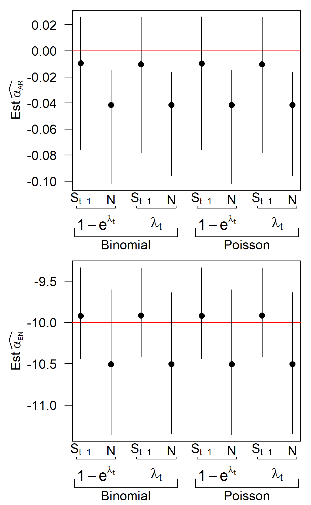
<p class="caption">Red lines indicate true parameter value; blue line is at zero.</p>
</div>


```r
kable(res_r0mod, caption=paste('Summary of parameter estimates from', Nsims, 'simulations, where alpha_ar =', sprintf('%.3f', alpha_ar), 'and alpha_en =', alpha_en ), digits=4)
```


Table: Summary of parameter estimates from 250 simulations, where alpha_ar = 0.000 and alpha_en = -10

 mod    Est.ar   pct.025.ar   pct.975.ar   Bias.ar   MSE.ar     Est.en   pct.025.en   pct.975.en   Bias.en   MSE.en
----  --------  -----------  -----------  --------  -------  ---------  -----------  -----------  --------  -------
   1   -0.0097      -0.0758       0.0259   -0.0097   0.0007    -9.9181     -10.4353      -9.3373    0.0819   0.0851
   2   -0.0416      -0.1019      -0.0150   -0.0416   0.0022   -10.5054     -11.3577      -9.6039   -0.5054   0.4303
   3   -0.0104      -0.0784       0.0258   -0.0104   0.0007    -9.9150     -10.4178      -9.3384    0.0850   0.0851
   4   -0.0416      -0.0956      -0.0162   -0.0416   0.0021   -10.5051     -11.3486      -9.6409   -0.5051   0.4158
   5   -0.0097      -0.0758       0.0262   -0.0097   0.0007    -9.9181     -10.4353      -9.3373    0.0819   0.0851
   6   -0.0416      -0.1019      -0.0150   -0.0416   0.0022   -10.5048     -11.3577      -9.6039   -0.5048   0.4296
   7   -0.0104      -0.0784       0.0258   -0.0104   0.0007    -9.9149     -10.4178      -9.3384    0.0851   0.0849
   8   -0.0416      -0.0956      -0.0162   -0.0416   0.0021   -10.5050     -11.3486      -9.6409   -0.5050   0.4155


##  $R_0 = 0.75$

```r
alpha_ar = log(0.75)

set.seed(47)
sim_r0lo=replicate(Nsims, sim.simple(N=N, Nwks=3*52, alpha_ar=alpha_ar, alpha_en=alpha_en))

vals=c(alpha_ar, alpha_en)

res_r0lo = plyr::ldply(1:8, function(i){
        m = paste0('mod', i)
        
        est=sapply(sim_r0lo[m, ], function(x){x$par})
        ests = rowMeans(est)
        se.ests = apply(est, 1, sd)
        percentiles = apply(est, 1, function(x){quantile(x, c(0.025, 0.975))})
        
        bias = rowMeans(sapply(sim_r0lo[m, ], function(x){(x$par - vals)}))
        mse = rowMeans(sapply(sim_r0lo[m, ], function(x){(x$par - vals)^2}))
        c(mod = i, Est.ar = ests[1], pct.025.ar = as.numeric(percentiles[1, 1]), pct.975.ar = as.numeric(percentiles[2, 1]), Bias.ar = bias[1], MSE.ar = mse[1], 
          Est.en = ests[2], pct.025.en = as.numeric(percentiles[1, 2]), pct.975.en = as.numeric(percentiles[2, 2]), Bias.en = bias[2], MSE.en = mse[2])

})
```

Examples of simulated epidemic curves when $R_0=0.75$
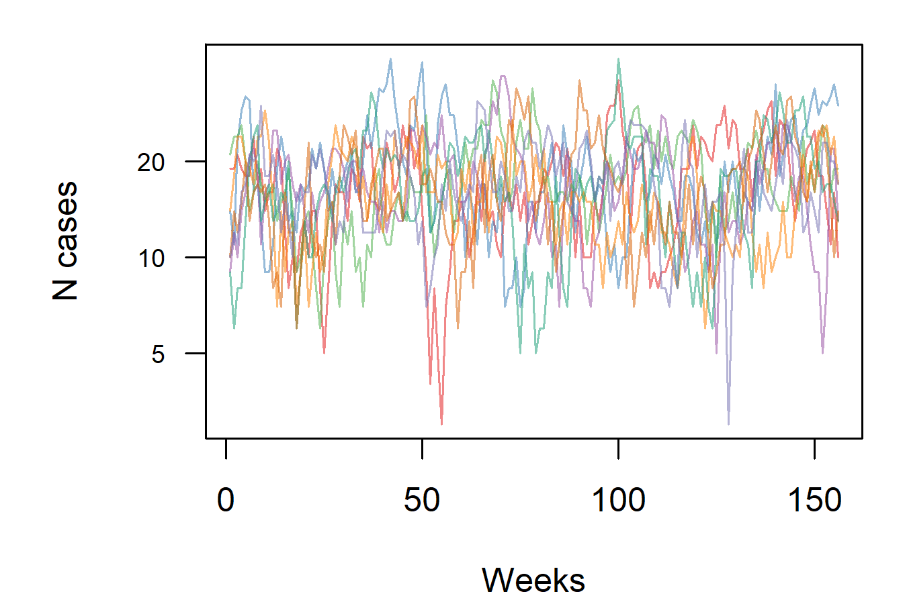


```r
par(mfrow=c(2, 1), mar=c(3.75, 3, 0.5, 0.5)+0.15, oma=c(0.2, 1.5, 0, 0))
## Plots of estimates
rng.ar = range(res_r0lo$Est.ar, res_r0lo$pct.025.ar, res_r0lo$pct.975.ar, alpha_ar)
        
plot(x=c(1, 8), y=rng.ar, type='n', xaxt='n', ylab='', xlab='', las=1) 
abline(h=alpha_ar, col='#ff0000')
mtext(expression(Est~ widehat(alpha[scriptscriptstyle(AR)])), side=2, line=3)
mtext(1, at=1:8, text=rep(c(expression(S[t-1]), 'N'), 4), line=0.1, cex=1)
axis(1, at=c(1, 2)+c(-0.15, 0.15), labels=rep('', 2), line=1.15, tck=0.01)
axis(1, at=c(3, 4)+c(-0.15, 0.15), labels=rep('', 2), line=1.15, tck=0.01)
axis(1, at=c(5, 6)+c(-0.15, 0.15), labels=rep('', 2), line=1.15, tck=0.01)
axis(1, at=c(7, 8)+c(-0.15, 0.15), labels=rep('', 2), line=1.15, tck=0.01)
mtext(1, at=seq(1.5, 8, by=2), text=rep(c(expression(1-e^lambda[t]), expression(lambda[t])), 2 ), line=1.75, cex=1.15)
axis(1, at=c(1, 4)+c(-0.2, 0.2), labels=rep('', 2), line=3, tck=0.05)
axis(1, at=c(5, 8)+c(-0.2, 0.2), labels=rep('', 2), line=3, tck=0.05)
mtext(1, at=c(2.5, 6.5), text=c('Binomial', 'Poisson'), line=3, cex=1)
points(x=1:8, y=res_r0lo$Est.ar, pch=16)
for(i in 1:8){
        segments(x0=i, x1=i, y0=res_r0lo$pct.025.ar[i], y1=res_r0lo$pct.975.ar[i])
}

rng.en = range(res_r0lo$Est.en, res_r0lo$pct.025.en, res_r0lo$pct.975.en, alpha_en)

plot(x=c(1, 8), y=rng.en, type='n', xaxt='n', ylab='', xlab='', las=1) 
abline(h=alpha_en, col='#ff0000')
mtext(expression(Est~widehat(alpha[scriptscriptstyle(EN)])), side=2, line=3)
mtext(1, at=1:8, text=rep(c(expression(S[t-1]), 'N'), 4), line=0.1, cex=1)
axis(1, at=c(1, 2)+c(-0.15, 0.15), labels=rep('', 2), line=1.15, tck=0.01)
axis(1, at=c(3, 4)+c(-0.15, 0.15), labels=rep('', 2), line=1.15, tck=0.01)
axis(1, at=c(5, 6)+c(-0.15, 0.15), labels=rep('', 2), line=1.15, tck=0.01)
axis(1, at=c(7, 8)+c(-0.15, 0.15), labels=rep('', 2), line=1.15, tck=0.01)
mtext(1, at=seq(1.5, 8, by=2), text=rep(c(expression(1-e^lambda[t]), expression(lambda[t])), 2 ), line=1.75, cex=1.15)
axis(1, at=c(1, 4)+c(-0.2, 0.2), labels=rep('', 2), line=3, tck=0.05)
axis(1, at=c(5, 8)+c(-0.2, 0.2), labels=rep('', 2), line=3, tck=0.05)
mtext(1, at=c(2.5, 6.5), text=c('Binomial', 'Poisson'), line=3, cex=1)
points(x=1:8, y=res_r0lo$Est.en, pch=16)
for(i in 1:8){
        segments(x0=i, x1=i, y0=res_r0lo$pct.025.en[i], y1=res_r0lo$pct.975.en[i])
}


#### Plots of Bias
rng.ar = range(res_r0lo$Bias.ar, 0)
        
plot(x=c(1, 8), y=rng.ar, type='n', xaxt='n', ylab='', xlab='', las=1) 
abline(h=0, col='#0000ff')
mtext(expression(Bias~ widehat(alpha[scriptscriptstyle(AR)])), side=2, line=3)
mtext(1, at=1:8, text=rep(c(expression(S[t-1]), 'N'), 4), line=0.1, cex=1)
axis(1, at=c(1, 2)+c(-0.15, 0.15), labels=rep('', 2), line=1.15, tck=0.01)
axis(1, at=c(3, 4)+c(-0.15, 0.15), labels=rep('', 2), line=1.15, tck=0.01)
axis(1, at=c(5, 6)+c(-0.15, 0.15), labels=rep('', 2), line=1.15, tck=0.01)
axis(1, at=c(7, 8)+c(-0.15, 0.15), labels=rep('', 2), line=1.15, tck=0.01)
mtext(1, at=seq(1.5, 8, by=2), text=rep(c(expression(1-e^lambda[t]), expression(lambda[t])), 2 ), line=1.75, cex=1.15)
axis(1, at=c(1, 4)+c(-0.2, 0.2), labels=rep('', 2), line=3, tck=0.05)
axis(1, at=c(5, 8)+c(-0.2, 0.2), labels=rep('', 2), line=3, tck=0.05)
mtext(1, at=c(2.5, 6.5), text=c('Binomial', 'Poisson'), line=3, cex=1)
points(x=1:8, y=res_r0lo$Bias.ar, pch=16)

rng.en = range(res_r0lo$Bias.en, 0)

plot(x=c(1, 8), y=rng.en, type='n', xaxt='n', ylab='', xlab='', las=1) 
abline(h=0, col='#0000ff')
mtext(expression(Bias~widehat(alpha[scriptscriptstyle(EN)])), side=2, line=3)
mtext(1, at=1:8, text=rep(c(expression(S[t-1]), 'N'), 4), line=0.1, cex=1)
axis(1, at=c(1, 2)+c(-0.15, 0.15), labels=rep('', 2), line=1.15, tck=0.01)
axis(1, at=c(3, 4)+c(-0.15, 0.15), labels=rep('', 2), line=1.15, tck=0.01)
axis(1, at=c(5, 6)+c(-0.15, 0.15), labels=rep('', 2), line=1.15, tck=0.01)
axis(1, at=c(7, 8)+c(-0.15, 0.15), labels=rep('', 2), line=1.15, tck=0.01)
mtext(1, at=seq(1.5, 8, by=2), text=rep(c(expression(1-e^lambda[t]), expression(lambda[t])), 2 ), line=1.75, cex=1.15)
axis(1, at=c(1, 4)+c(-0.2, 0.2), labels=rep('', 2), line=3, tck=0.05)
axis(1, at=c(5, 8)+c(-0.2, 0.2), labels=rep('', 2), line=3, tck=0.05)
mtext(1, at=c(2.5, 6.5), text=c('Binomial', 'Poisson'), line=3, cex=1)
points(x=1:8, y=res_r0lo$Bias.en, pch=16)


rng.ar = range(res_r0lo$MSE.ar, 0)
        
plot(x=c(1, 8), y=rng.ar, type='n', xaxt='n', ylab='', xlab='', las=1) 
abline(h=0, col='#0000ff')
mtext(expression(MSE~ widehat(alpha[scriptscriptstyle(AR)])), side=2, line=3)
mtext(1, at=1:8, text=rep(c(expression(S[t-1]), 'N'), 4), line=0.1, cex=1)
axis(1, at=c(1, 2)+c(-0.15, 0.15), labels=rep('', 2), line=1.15, tck=0.01)
axis(1, at=c(3, 4)+c(-0.15, 0.15), labels=rep('', 2), line=1.15, tck=0.01)
axis(1, at=c(5, 6)+c(-0.15, 0.15), labels=rep('', 2), line=1.15, tck=0.01)
axis(1, at=c(7, 8)+c(-0.15, 0.15), labels=rep('', 2), line=1.15, tck=0.01)
mtext(1, at=seq(1.5, 8, by=2), text=rep(c(expression(1-e^lambda[t]), expression(lambda[t])), 2 ), line=1.75, cex=1.15)
axis(1, at=c(1, 4)+c(-0.2, 0.2), labels=rep('', 2), line=3, tck=0.05)
axis(1, at=c(5, 8)+c(-0.2, 0.2), labels=rep('', 2), line=3, tck=0.05)
mtext(1, at=c(2.5, 6.5), text=c('Binomial', 'Poisson'), line=3, cex=1)
points(x=1:8, y=res_r0lo$MSE.ar, pch=16)

rng.en = range(res_r0lo$MSE.en, 0)

plot(x=c(1, 8), y=rng.en, type='n', xaxt='n', ylab='', xlab='', las=1) 
abline(h=0, col='#0000ff')
mtext(expression(MSE~widehat(alpha[scriptscriptstyle(EN)])), side=2, line=3)
mtext(1, at=1:8, text=rep(c(expression(S[t-1]), 'N'), 4), line=0.1, cex=1)
axis(1, at=c(1, 2)+c(-0.15, 0.15), labels=rep('', 2), line=1.15, tck=0.01)
axis(1, at=c(3, 4)+c(-0.15, 0.15), labels=rep('', 2), line=1.15, tck=0.01)
axis(1, at=c(5, 6)+c(-0.15, 0.15), labels=rep('', 2), line=1.15, tck=0.01)
axis(1, at=c(7, 8)+c(-0.15, 0.15), labels=rep('', 2), line=1.15, tck=0.01)
mtext(1, at=seq(1.5, 8, by=2), text=rep(c(expression(1-e^lambda[t]), expression(lambda[t])), 2 ), line=1.75, cex=1.15)
axis(1, at=c(1, 4)+c(-0.2, 0.2), labels=rep('', 2), line=3, tck=0.05)
axis(1, at=c(5, 8)+c(-0.2, 0.2), labels=rep('', 2), line=3, tck=0.05)
mtext(1, at=c(2.5, 6.5), text=c('Binomial', 'Poisson'), line=3, cex=1)
points(x=1:8, y=res_r0lo$MSE.en, pch=16)


# 
```

<div class="figure">
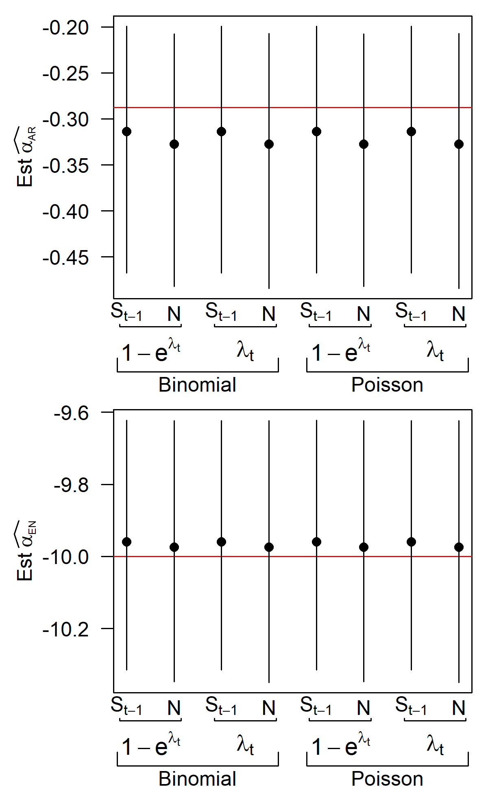
<p class="caption">Red lines indicate true parameter value; blue line is at zero.</p>
</div>


```r
# 
kable(res_r0lo, caption=paste('Summary of parameter estimates from', Nsims, 'simulations, where alpha_ar =', sprintf('%.3f', alpha_ar), 'and alpha_en =', alpha_en ), digits=4)
```


Table: Summary of parameter estimates from 250 simulations, where alpha_ar = -0.288 and alpha_en = -10

 mod    Est.ar   pct.025.ar   pct.975.ar   Bias.ar   MSE.ar    Est.en   pct.025.en   pct.975.en   Bias.en   MSE.en
----  --------  -----------  -----------  --------  -------  --------  -----------  -----------  --------  -------
   1   -0.3137      -0.4674      -0.1993   -0.0261   0.0065   -9.9595     -10.3147      -9.6225    0.0405   0.0372
   2   -0.3274      -0.4820      -0.2076   -0.0397   0.0075   -9.9741     -10.3469      -9.6231    0.0259   0.0368
   3   -0.3139      -0.4674      -0.1993   -0.0262   0.0065   -9.9592     -10.3147      -9.6232    0.0408   0.0371
   4   -0.3275      -0.4843      -0.2071   -0.0399   0.0075   -9.9741     -10.3493      -9.6229    0.0259   0.0369
   5   -0.3138      -0.4674      -0.1993   -0.0261   0.0065   -9.9594     -10.3147      -9.6225    0.0406   0.0372
   6   -0.3274      -0.4820      -0.2076   -0.0397   0.0075   -9.9741     -10.3469      -9.6231    0.0259   0.0368
   7   -0.3139      -0.4674      -0.1993   -0.0262   0.0065   -9.9592     -10.3147      -9.6232    0.0408   0.0371
   8   -0.3276      -0.4843      -0.2071   -0.0399   0.0075   -9.9740     -10.3493      -9.6229    0.0260   0.0370


## Summary

```r
r0_cols=c('#D92321', '#FF6F1B', '#0AB7C9')


#### Plots of Bias
rng.ar = range(res_r0big$Bias.ar, res_r0mod$Bias.ar, res_r0lo$Bias.ar, 0, 0.05)
        
plot(x=c(1, 8), y=rng.ar, type='n', xaxt='n', ylab='', xlab='', las=1) 
abline(h=0, col='#000000')
mtext(expression(Bias~ widehat(alpha[scriptscriptstyle(AR)])), side=2, line=3)
mtext(1, at=1:8, text=rep(c(expression(S[t-1]), 'N'), 4), line=0.1, cex=1)
axis(1, at=c(1, 2)+c(-0.15, 0.15), labels=rep('', 2), line=1.15, tck=0.01)
axis(1, at=c(3, 4)+c(-0.15, 0.15), labels=rep('', 2), line=1.15, tck=0.01)
axis(1, at=c(5, 6)+c(-0.15, 0.15), labels=rep('', 2), line=1.15, tck=0.01)
axis(1, at=c(7, 8)+c(-0.15, 0.15), labels=rep('', 2), line=1.15, tck=0.01)
mtext(1, at=seq(1.5, 8, by=2), text=rep(c(expression(1-e^lambda[t]), expression(lambda[t])), 2 ), line=1.75, cex=1.15)
axis(1, at=c(1, 4)+c(-0.2, 0.2), labels=rep('', 2), line=3, tck=0.05)
axis(1, at=c(5, 8)+c(-0.2, 0.2), labels=rep('', 2), line=3, tck=0.05)
mtext(1, at=c(2.5, 6.5), text=c('Binomial', 'Poisson'), line=3, cex=1)
points(x=1:8-0.15, y=res_r0big$Bias.ar, pch=16, col=r0_cols[1])
points(x=1:8, y=res_r0mod$Bias.ar, pch=16, col=r0_cols[2])
points(x=1:8+0.15, y=res_r0lo$Bias.ar, pch=16, col=r0_cols[3])
legend('top', legend=c(expression(R[0]==2.5), expression(R[0]==1), expression(R[0]==0.75)), col=r0_cols, pch=rep(16), bty='n', horiz=T, xpd=T, inset=c(0, -0.1))


rng.en = range(res_r0big$Bias.en, res_r0mod$Bias.en, res_r0lo$Bias.en, 0, 0.05)

plot(x=c(1, 8), y=rng.en, type='n', xaxt='n', ylab='', xlab='', las=1) 
abline(h=0, col='#000000')
mtext(expression(Bias~widehat(alpha[scriptscriptstyle(EN)])), side=2, line=3)
mtext(1, at=1:8, text=rep(c(expression(S[t-1]), 'N'), 4), line=0.1, cex=1)
axis(1, at=c(1, 2)+c(-0.15, 0.15), labels=rep('', 2), line=1.15, tck=0.01)
axis(1, at=c(3, 4)+c(-0.15, 0.15), labels=rep('', 2), line=1.15, tck=0.01)
axis(1, at=c(5, 6)+c(-0.15, 0.15), labels=rep('', 2), line=1.15, tck=0.01)
axis(1, at=c(7, 8)+c(-0.15, 0.15), labels=rep('', 2), line=1.15, tck=0.01)
mtext(1, at=seq(1.5, 8, by=2), text=rep(c(expression(1-e^lambda[t]), expression(lambda[t])), 2 ), line=1.75, cex=1.15)
axis(1, at=c(1, 4)+c(-0.2, 0.2), labels=rep('', 2), line=3, tck=0.05)
axis(1, at=c(5, 8)+c(-0.2, 0.2), labels=rep('', 2), line=3, tck=0.05)
mtext(1, at=c(2.5, 6.5), text=c('Binomial', 'Poisson'), line=3, cex=1)
points(x=1:8-0.15, y=res_r0big$Bias.en, pch=16, col=r0_cols[1])
points(x=1:8, y=res_r0mod$Bias.en, pch=16, col=r0_cols[2])
points(x=1:8+0.15, y=res_r0lo$Bias.en, pch=16, col=r0_cols[3])
legend('top', legend=c(expression(R[0]==2.5), expression(R[0]==1), expression(R[0]==0.75)), col=r0_cols, pch=rep(16), bty='n', horiz=T, xpd=T, inset=c(0, -0.1))


#### Plots of MSE
rng.ar = range(res_r0big$MSE.ar, res_r0mod$MSE.ar, res_r0lo$MSE.ar, 0, 0.05)
        
plot(x=c(1, 8), y=rng.ar, type='n', xaxt='n', ylab='', xlab='', las=1) 
abline(h=0, col='#000000')
mtext(expression(MSE~ widehat(alpha[scriptscriptstyle(AR)])), side=2, line=3)
mtext(1, at=1:8, text=rep(c(expression(S[t-1]), 'N'), 4), line=0.1, cex=1)
axis(1, at=c(1, 2)+c(-0.15, 0.15), labels=rep('', 2), line=1.15, tck=0.01)
axis(1, at=c(3, 4)+c(-0.15, 0.15), labels=rep('', 2), line=1.15, tck=0.01)
axis(1, at=c(5, 6)+c(-0.15, 0.15), labels=rep('', 2), line=1.15, tck=0.01)
axis(1, at=c(7, 8)+c(-0.15, 0.15), labels=rep('', 2), line=1.15, tck=0.01)
mtext(1, at=seq(1.5, 8, by=2), text=rep(c(expression(1-e^lambda[t]), expression(lambda[t])), 2 ), line=1.75, cex=1.15)
axis(1, at=c(1, 4)+c(-0.2, 0.2), labels=rep('', 2), line=3, tck=0.05)
axis(1, at=c(5, 8)+c(-0.2, 0.2), labels=rep('', 2), line=3, tck=0.05)
mtext(1, at=c(2.5, 6.5), text=c('Binomial', 'Poisson'), line=3, cex=1)
points(x=1:8-0.15, y=res_r0big$MSE.ar, pch=16, col=r0_cols[1])
points(x=1:8, y=res_r0mod$MSE.ar, pch=16, col=r0_cols[2])
points(x=1:8+0.15, y=res_r0lo$MSE.ar, pch=16, col=r0_cols[3])
legend('top', legend=c(expression(R[0]==2.5), expression(R[0]==1), expression(R[0]==0.75)), col=r0_cols, pch=rep(16), bty='n', horiz=T, xpd=T, inset=c(0, -0.1))


rng.en = range(res_r0big$MSE.en, res_r0mod$MSE.en, res_r0lo$MSE.en, 0, 0.05)

plot(x=c(1, 8), y=rng.en, type='n', xaxt='n', ylab='', xlab='', las=1) 
abline(h=0, col='#000000')
mtext(expression(MSE~widehat(alpha[scriptscriptstyle(EN)])), side=2, line=3)
mtext(1, at=1:8, text=rep(c(expression(S[t-1]), 'N'), 4), line=0.1, cex=1)
axis(1, at=c(1, 2)+c(-0.15, 0.15), labels=rep('', 2), line=1.15, tck=0.01)
axis(1, at=c(3, 4)+c(-0.15, 0.15), labels=rep('', 2), line=1.15, tck=0.01)
axis(1, at=c(5, 6)+c(-0.15, 0.15), labels=rep('', 2), line=1.15, tck=0.01)
axis(1, at=c(7, 8)+c(-0.15, 0.15), labels=rep('', 2), line=1.15, tck=0.01)
mtext(1, at=seq(1.5, 8, by=2), text=rep(c(expression(1-e^lambda[t]), expression(lambda[t])), 2 ), line=1.75, cex=1.15)
axis(1, at=c(1, 4)+c(-0.2, 0.2), labels=rep('', 2), line=3, tck=0.05)
axis(1, at=c(5, 8)+c(-0.2, 0.2), labels=rep('', 2), line=3, tck=0.05)
mtext(1, at=c(2.5, 6.5), text=c('Binomial', 'Poisson'), line=3, cex=1)
points(x=1:8-0.15, y=res_r0big$MSE.en, pch=16, col=r0_cols[1])
points(x=1:8, y=res_r0mod$MSE.en, pch=16, col=r0_cols[2])
points(x=1:8+0.15, y=res_r0lo$MSE.en, pch=16, col=r0_cols[3])
legend('top', legend=c(expression(R[0]==2.5), expression(R[0]==1), expression(R[0]==0.75)), col=r0_cols, pch=rep(16), bty='n', horiz=T, xpd=T, inset=c(0, -0.1))
```


# Simulations in partially vaccinated populations {.tabset}


```r
source('ecofall_sim_functions.R')

N=rep(1e5, 5)
x=c(0.65, 0.7, 0.75, 0.8, 0.85) 
phi0=0
phi=0.8
alpha_ar = log(2)
alpha_en =   1
exp(alpha_ar)*(1-phi*x)
Nwks=52*3 # Number of weeks
# Nsims=1e2
sts=c(0.5, 0, 1)
```


Below, we plot examples of a population consisting of 5 areas

```r
pltcols=rev(brewer.pal(6, 'PuRd')[-1])
axis.pts=c(0.5, 1, 2, 5, c(1, 2, 5)*10, c(1, 2, 5)*1e2, c(1, 2, 5)*1e3, c(1, 2, 5)*1e4, c(1, 2, 5)*1e5)
axis.labs=c(0, 1, 2, 5, c(1, 2, 5)*10, c(1, 2, 5)*1e2, c(1, 2, 5)*1e3, c(1, 2, 5)*1e4, c(1, 2, 5)*1e5)

reff=exp(alpha_ar)*(1-phi*x)

par(mar=c(4, 5, 1, 1)+0.1)


set.seed(666)
obs=sim.lk.pops(Npops=N, nwks=Nwks, AR=alpha_ar, EN=alpha_en, Phi=phi0, X=x, y0=c(1, 0))
tmp=t(obs$Y)
tmp[which(tmp==0)]=0.5
matplot(tmp, type='l', col=pltcols,  ylab='Counts', xlab='Weeks', lty=1, log='y', yaxt='n')
axis(2, at=axis.pts, labels=axis.labs, las=2, cex.axis=0.85)
legend('topright', legend=c('R', rep(exp(alpha_ar), 5), expression(x[i]),  paste0(100*x, '%')), ncol=2, lty=c(rep(NA, 7), rep(1, 5)), col=c(rep(NA, 7), pltcols), bty='n', cex=0.75)


obs=sim.AoN.pops(Npops=N, nwks=Nwks, AR=alpha_ar, EN=alpha_en, Phi=phi, X=x, y0=c(1, 0))
tmp=t(obs$Y)
tmp[which(tmp==0)]=0.5
matplot(tmp, type='l', col=pltcols,  ylab='Counts', xlab='Weeks', lty=1, log='y', yaxt='n', ylim=c(0.5, 650))
axis(2, at=axis.pts, labels=axis.labs, las=2, cex.axis=0.85)
legend('topright', legend=c('R', format(reff, 2), expression(x[i]),  paste0(100*x, '%')), ncol=2, lty=c(rep(NA, 7), rep(1, 5)), col=c(rep(NA, 7), pltcols),  bty='n', cex=0.75)


obs=sim.lk.pops(Npops=N, nwks=Nwks, AR=alpha_ar, EN=alpha_en, Phi=phi, X=x, y0=c(1, 0))
tmp=t(obs$Y)
tmp[which(tmp==0)]=0.5
matplot(tmp, type='l', col=pltcols,  ylab='Counts', xlab='Weeks', lty=1, log='y', yaxt='n', ylim=c(0.5, 650))
axis(2, at=axis.pts, labels=axis.labs, las=2, cex.axis=0.85)
legend('topright', legend=c('R', format(reff, 2), expression(x[i]),  paste0(100*x, '%')), ncol=2, lty=c(rep(NA, 7), rep(1, 5)), col=c(rep(NA, 7), pltcols), bty='n', cex=0.75)
```


```r
reff=exp(alpha_ar)*(1-phi*x)

par(mar=c(0, 0, 0, 0))
# plot(x=c(0, 1), y=c(0, 1), type='n', bty='n', xaxt='n', yaxt='n', xlab='', ylab='')
plot.new()
legend(x=0, y=1, legend=c('R', format(reff, digits=2)), ncol=1, lty=c(rep(NA, 7), rep(1, 5)), col=rep(NA, 7), bty='n', x.intersp = 0, seg.len=1)

legend(x=0.4, y=1, legend=c(expression(x[i]),  paste0(100*x, '%')), ncol=1, lty=c(NA, rep(1, 5)), col=c(NA, pltcols), bty='n', x.intersp = 0.5, seg.len=1)
```


```r
vals=c(alpha_ar, alpha_en, phi)

set.seed(4747)
aon_sims=replicate(Nsims, sim.one(vacc='AoN', N=N, Nwks=Nwks, alpha_ar=alpha_ar, alpha_en=alpha_en, phi=phi, x=x))

res_aon = plyr::ldply(1:4, function(i){
        m = paste0('mod', i)
        
        est=sapply(aon_sims[m, ], function(x){c(x$par[1:2], expit(x$par[3]))})
        ests = rowMeans(est)
        percentiles = apply(est, 1, function(x){quantile(x, c(0.025, 0.975))})
        se.ests = apply(est, 1, sd)
        
        bias = rowMeans(apply(est, 2, function(x){(x - vals)}))
        mse = rowMeans(apply(est, 2, function(x){(x - vals)^2}))
        
        c(mod = i, Est.ar = ests[1],  pct.025.ar = as.numeric(percentiles[1, 1]), pct.975.ar = as.numeric(percentiles[2, 1]),  Bias.ar = bias[1], MSE.ar = mse[1], 
          Est.en = ests[2], pct.025.en = as.numeric(percentiles[1, 2]), pct.975.en = as.numeric(percentiles[2, 2]), Bias.en = bias[2], MSE.en = mse[2],
          Est.phi = ests[3], pct.025.phi = as.numeric(percentiles[1, 3]), pct.975.phi = as.numeric(percentiles[2, 3]), Bias.phi = bias[3], MSE.phi = mse[3])

})


# set.seed(4747)
lk_sims=replicate(Nsims, sim.one(vacc='lk', N=N, Nwks=Nwks, alpha_ar=alpha_ar, alpha_en=alpha_en, phi=phi, x=x))


res_lk = plyr::ldply(1:4, function(i){
        m = paste0('mod', i)
        
        est=sapply(lk_sims[m, ], function(x){c(x$par[1:2], expit(x$par[3]))})
        ests = rowMeans(est)
        percentiles = apply(est, 1, function(x){quantile(x, c(0.025, 0.975))})
        se.ests = apply(est, 1, sd)
        
        bias = rowMeans(apply(est, 2, function(x){(x - vals)}))
        mse = rowMeans(apply(est, 2, function(x){(x - vals)^2}))
        
        c(mod = i, Est.ar = ests[1],  pct.025.ar = as.numeric(percentiles[1, 1]), pct.975.ar = as.numeric(percentiles[2, 1]),  Bias.ar = bias[1], MSE.ar = mse[1], 
          Est.en = ests[2], pct.025.en = as.numeric(percentiles[1, 2]), pct.975.en = as.numeric(percentiles[2, 2]), Bias.en = bias[2], MSE.en = mse[2],
          Est.phi = ests[3], pct.025.phi = as.numeric(percentiles[1, 3]), pct.975.phi = as.numeric(percentiles[2, 3]), Bias.phi = bias[3], MSE.phi = mse[3])
        
})
```


## All-or-none vaccine

```r
mod1.ests=sapply(aon_sims['mod1', ], function(x){x$par})
mod1.est=rowMeans(mod1.ests)
mod1.qt=apply(mod1.ests, 1, function(x){quantile(x, c(0.025, 0.975))})

mod2.ests=sapply(aon_sims['mod2', ], function(x){x$par})
mod2.est=rowMeans(mod2.ests)
mod2.qt=apply(mod2.ests, 1, function(x){quantile(x, c(0.025, 0.975))})

mod3.ests=sapply(aon_sims['mod3', ], function(x){x$par})
mod3.est=rowMeans(mod3.ests)
mod3.qt=apply(mod3.ests, 1, function(x){quantile(x, c(0.025, 0.975))})


mod4.ests=sapply(aon_sims['mod4', ], function(x){x$par})
mod4.est=rowMeans(mod4.ests)
mod4.qt=apply(mod4.ests, 1, function(x){quantile(x, c(0.025, 0.975))})


par(mar=c(3, 3.1, 0, 0)+0.2)
plot(x=c(0.5, 4.5), y=c(-0.15, 1), type='n', xaxt='n', ylab='', xlab='', xaxs='i')
mtext(expression( widehat(alpha[scriptscriptstyle(AR)])), side=2, line=2)
abline(h=alpha_ar, col='red')
axis(1, at=1:4, labels=c('All-or-none', 'Leaky', 'Ecological', 'Epidemic-\nEndemic'), padj=0.5)
points(x=1:4, y=c(mod1.est[1], mod2.est[1], mod3.est[1], mod4.est[1]), pch=16)
segments(x0=1, x1=1, y0=mod1.qt[1, 1], y1=mod1.qt[2, 1])
segments(x0=2, x1=2, y0=mod2.qt[1, 1], y1=mod2.qt[2, 1])
segments(x0=3, x1=3, y0=mod3.qt[1, 1], y1=mod3.qt[2, 1])
segments(x0=4, x1=4, y0=mod4.qt[1, 1], y1=mod4.qt[2, 1])

plot(x=c(0.5, 4.5), y=c(1, 3.25), type='n', xaxt='n', ylab='', xlab='', xaxs='i')
mtext(expression( widehat(alpha[scriptscriptstyle(EN)])), side=2, line=2)
abline(h=alpha_en, col='red')
axis(1, at=1:4, labels=c('All-or-none', 'Leaky', 'Ecological', 'Epidemic-\nEndemic'), padj=0.5)
points(x=1:4, y=c(mod1.est[2], mod2.est[2], mod3.est[2], mod4.est[2]), pch=16)
segments(x0=1, x1=1, y0=mod1.qt[1, 2], y1=mod1.qt[2, 2])
segments(x0=2, x1=2, y0=mod2.qt[1, 2], y1=mod2.qt[2, 2])
segments(x0=3, x1=3, y0=mod3.qt[1, 2], y1=mod3.qt[2, 2])
segments(x0=4, x1=4, y0=mod4.qt[1, 2], y1=mod4.qt[2, 2])


plot(x=c(0.5, 3.5), y=c(0.25, 1.01), type='n', xaxt='n', ylab='', xlab='', xaxs='i')
mtext(expression(paste( widehat(phi))), side=2, line=2)
abline(h=phi, col='red')
axis(1, at=1:3, labels=c('All-or-none', 'Leaky', 'Ecological'))
points(x=1:3, y=c(expit(mod1.est[3]), expit(mod2.est[3]), expit(mod3.est[3])), pch=16)
segments(x0=1, x1=1, y0=expit(mod1.qt[1, 3]), y1=expit(mod1.qt[2, 3]))
segments(x0=2, x1=2, y0=expit(mod2.qt[1, 3]), y1=expit(mod2.qt[2, 3]))
segments(x0=3, x1=3, y0=expit(mod3.qt[1, 3]), y1=expit(mod3.qt[2, 3]))
```


```r
par(mar=c(3, 3.1, 0, 0)+0.2)

## Plot Estimates
plot(x=c(0.5, 4.5), y=rng.est.ar, type='n', xaxt='n', ylab='', xlab='', xaxs='i')
mtext(expression( widehat(alpha[scriptscriptstyle(AR)])), side=2, line=2)
abline(h=alpha_ar, col='red')
axis(1, at=1:4, labels=c('All-or-none', 'Leaky', 'Ecological', 'Epidemic-\nEndemic'), padj=0.5)
points(x=1:4, y=res_aon$Est.ar, pch=16)
for(i in 1:4){
        segments(x0=i, x1=i, y0=res_aon$pct.025.ar[i], y1=res_aon$pct.975.ar[i])
}

plot(x=c(0.5, 4.5), y=rng.est.en, type='n', xaxt='n', ylab='', xlab='', xaxs='i')
mtext(expression( widehat(alpha[scriptscriptstyle(EN)])), side=2, line=2)
abline(h=alpha_en, col='red')
axis(1, at=1:4, labels=c('All-or-none', 'Leaky', 'Ecological', 'Epidemic-\nEndemic'), padj=0.5)
points(x=1:4, y=res_aon$Est.en, pch=16)
for(i in 1:4){
        segments(x0=i, x1=i, y0=res_aon$pct.025.en[i], y1=res_aon$pct.975.en[i])
}


plot(x=c(0.5, 3.5), y=rng.est.phi, type='n', xaxt='n', ylab='', xlab='', xaxs='i')
mtext(expression(paste( widehat(phi))), side=2, line=2)
abline(h=phi, col='red')
axis(1, at=1:3, labels=c('All-or-none', 'Leaky', 'Ecological'))
points(x=1:3, y=res_aon$Est.phi[1:3], pch=16)
for(i in 1:3){
        segments(x0=i, x1=i, y0=res_aon$pct.025.phi[i], y1=res_aon$pct.975.phi[i])
}


## Plot bias of estimates
# rng.ar = range(res_aon$Bias.ar, 0)
plot(x=c(0.5, 4.5), y=rng.bias.ar, type='n', xaxt='n', ylab='', xlab='', xaxs='i')
mtext(expression(Bias~ widehat(alpha[scriptscriptstyle(AR)])), side=2, line=2)
abline(h=0, col='blue')
axis(1, at=1:4, labels=c('All-or-none', 'Leaky', 'Ecological', 'Epidemic-\nEndemic'), padj=0.5)
points(x=c(1:4), y=res_aon$Bias.ar, pch=16 )

# rng.en = range(res_aon$Bias.en, 0)
plot(x=c(0.5, 4.5), y=rng.bias.en, type='n', xaxt='n', ylab='', xlab='', xaxs='i')
mtext(expression(Bias~widehat(alpha[scriptscriptstyle(EN)])), side=2, line=2)
abline(h=0, col='blue')
axis(1, at=1:4, labels=c('All-or-none', 'Leaky', 'Ecological', 'Epidemic-\nEndemic'), padj=0.5)
points(x=1:4, y=res_aon$Bias.en, pch=16 )

# rng.phi = range(res_aon$Bias.phi[1:3], 0)
plot(x=c(0.5, 3.5), y=rng.bias.phi, type='n', xaxt='n', ylab='', xlab='', xaxs='i')
mtext(expression(Bias~paste( widehat(phi))), side=2, line=2)
abline(h=0, col='blue')
axis(1, at=1:3, labels=c('All-or-none', 'Leaky', 'Ecological'))
points(x=1:3, y=res_aon$Bias.phi[1:3], pch=16 )

## Plot MSE of estimates
# rng.ar = range(res_aon$MSE.ar, 0)
plot(x=c(0.5, 4.5), y=rng.MSE.ar, type='n', xaxt='n', ylab='', xlab='', xaxs='i')
mtext(expression(MSE~ widehat(alpha[scriptscriptstyle(AR)])), side=2, line=2)
abline(h=0, col='blue')
axis(1, at=1:4, labels=c('All-or-none', 'Leaky', 'Ecological', 'Epidemic-\nEndemic'), padj=0.5)
points(x=c(1:4), y=res_aon$MSE.ar, pch=16 )

# rng.en = range(res_aon$MSE.en, 0)
plot(x=c(0.5, 4.5), y=rng.MSE.en, type='n', xaxt='n', ylab='', xlab='', xaxs='i')
mtext(expression(MSE~widehat(alpha[scriptscriptstyle(EN)])), side=2, line=2)
abline(h=0, col='blue')
axis(1, at=1:4, labels=c('All-or-none', 'Leaky', 'Ecological', 'Epidemic-\nEndemic'), padj=0.5)
points(x=1:4, y=res_aon$MSE.en, pch=16 )

# rng.phi = range(res_aon$MSE.phi[1:3], 0)
plot(x=c(0.5, 3.5), y=rng.MSE.phi, type='n', xaxt='n', ylab='', xlab='', xaxs='i')
mtext(expression(MSE~paste( widehat(phi))), side=2, line=2)
abline(h=0, col='blue')
axis(1, at=1:3, labels=c('All-or-none', 'Leaky', 'Ecological'))
points(x=1:3, y=res_aon$MSE.phi[1:3], pch=16 )


# Table of results
kable(cbind(c('All-or-none', 'Leaky', 'Ecological', 'Epidemic-Endemic'), res_aon[, -1]),
      caption=paste('Summary of parameter estimates from', Nsims, 'simulations, where alpha_ar =', round(alpha_ar, 3), 'alpha_en =', alpha_en, 'and an all-or-none vaccine effect of', phi ), 
      digits=3, col.names=c('Model', 'Est AR', '2.5% AR', '97.5% AR', 'Bias AR', 'MSE AR', 'Est EN', '2.5% EN', '97.5% EN', 'Bias EN', 'MSE EN', 'Est Phi', '2.5% Phi', '97.5% Phi', 'Bias Phi', 'MSE Phi')
      )
```


Table: Summary of parameter estimates from 250 simulations, where alpha_ar = 0.693 alpha_en = 1 and an all-or-none vaccine effect of 0.8

Model               Est AR   2.5% AR   97.5% AR   Bias AR   MSE AR   Est EN   2.5% EN   97.5% EN   Bias EN   MSE EN   Est Phi   2.5% Phi   97.5% Phi   Bias Phi   MSE Phi
-----------------  -------  --------  ---------  --------  -------  -------  --------  ---------  --------  -------  --------  ---------  ----------  ---------  --------
All-or-none          0.680     0.588      0.742    -0.013    0.002    1.009     0.769      1.216     0.009    0.013     0.798      0.775       0.822     -0.002     0.000
Leaky                0.680     0.588      0.741    -0.013    0.002    1.010     0.771      1.218     0.010    0.013     0.799      0.776       0.822     -0.001     0.000
Ecological           0.661     0.353      0.894    -0.032    0.019    1.004     0.566      1.428     0.004    0.051     0.787      0.571       0.923     -0.013     0.009
Epidemic-Endemic     0.513     0.165      0.861    -0.181    0.062    0.056    -0.174      0.266    -0.944    0.905     0.631      0.564       0.701     -0.169     0.030

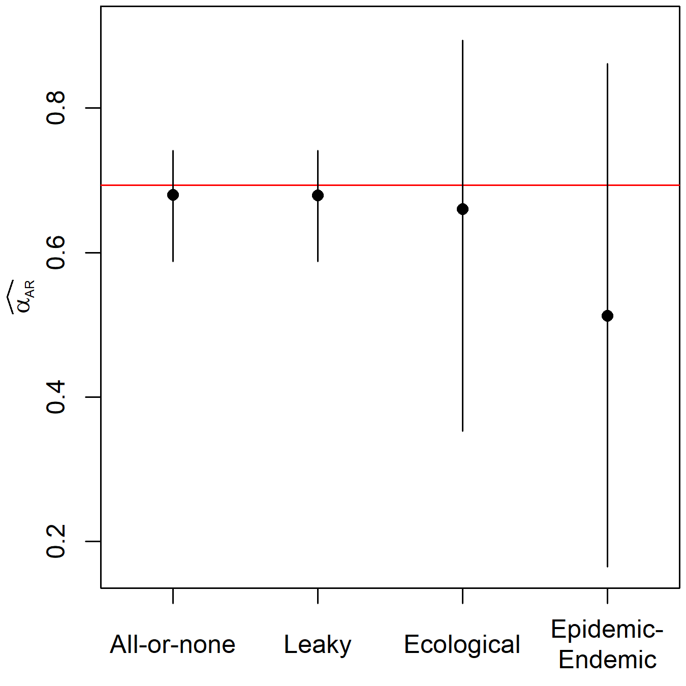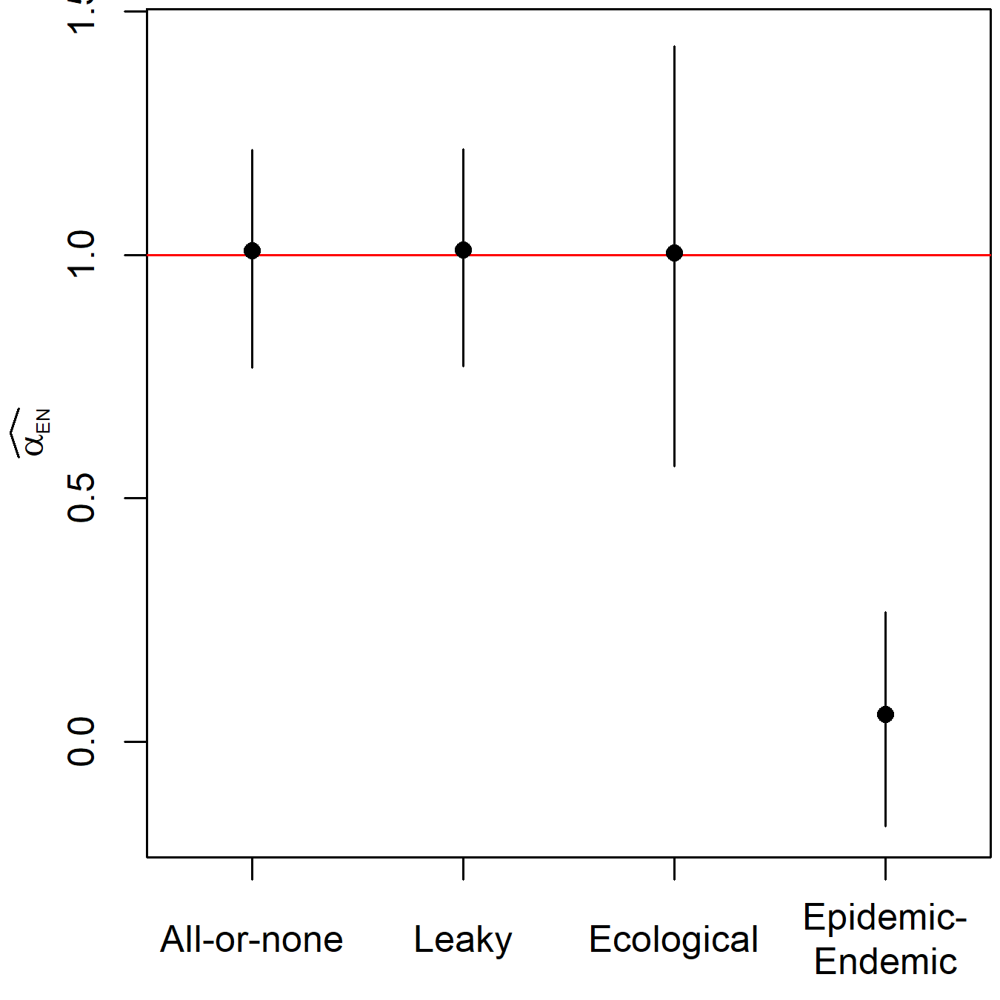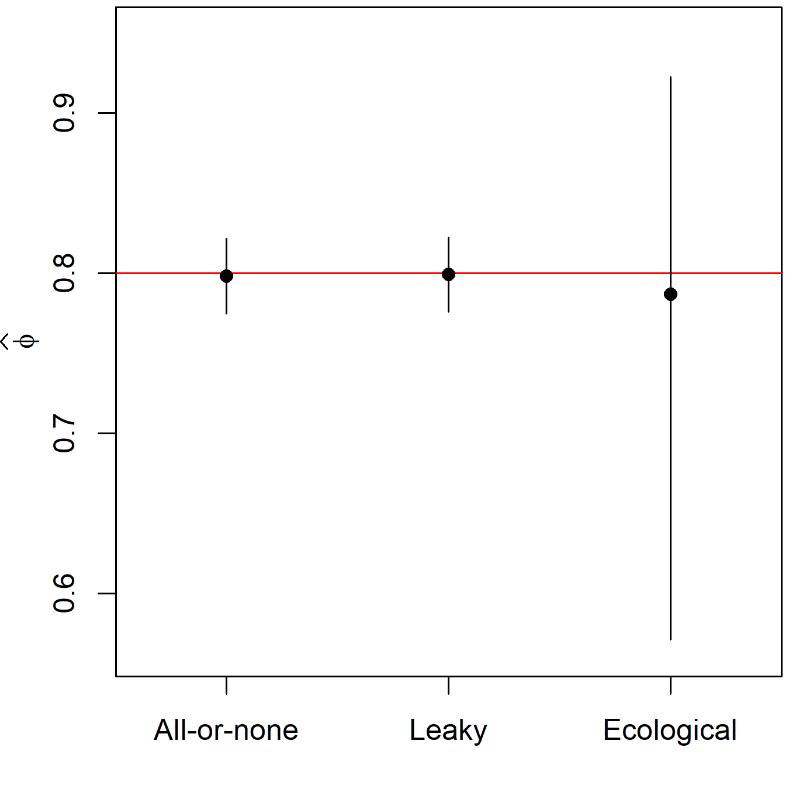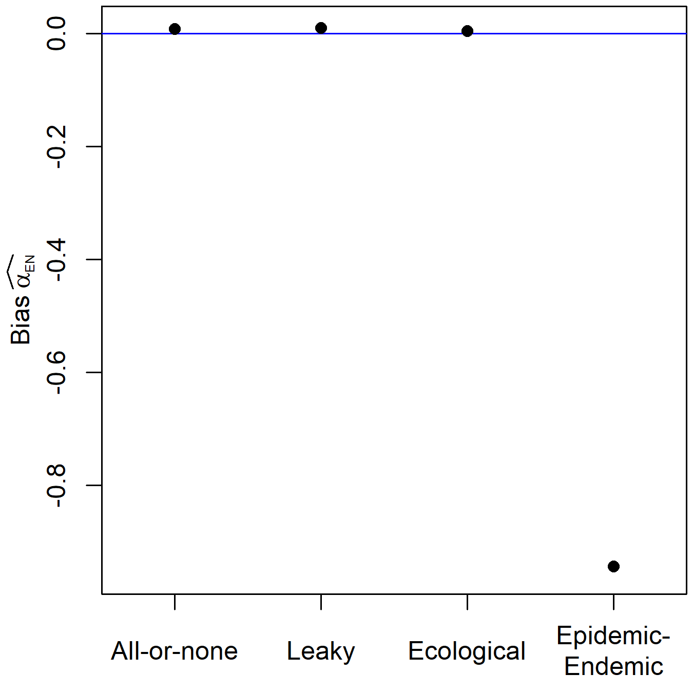


## Leaky vaccine


```r
mod1.ests=sapply(lk_sims['mod1', ], function(x){x$par})
mod1.est=rowMeans(mod1.ests)
mod1.qt=apply(mod1.ests, 1, function(x){quantile(x, c(0.025, 0.975))})

mod2.ests=sapply(lk_sims['mod2', ], function(x){x$par})
mod2.est=rowMeans(mod2.ests)
mod2.qt=apply(mod2.ests, 1, function(x){quantile(x, c(0.025, 0.975))})

mod3.ests=sapply(lk_sims['mod3', ], function(x){x$par})
mod3.est=rowMeans(mod3.ests)
mod3.qt=apply(mod3.ests, 1, function(x){quantile(x, c(0.025, 0.975))})


mod4.ests=sapply(lk_sims['mod4', ], function(x){x$par})
mod4.est=rowMeans(mod4.ests)
mod4.qt=apply(mod4.ests, 1, function(x){quantile(x, c(0.025, 0.975))})


par(mar=c(3, 3.1, 0, 0)+0.2)
plot(x=c(0.5, 4.5), y=c(-0.15, 1), type='n', xaxt='n', ylab='', xlab='', xaxs='i')
mtext(expression( widehat(alpha[scriptscriptstyle(AR)])), side=2, line=2)
abline(h=alpha_ar, col='red')
axis(1, at=1:4, labels=c('All-or-none', 'Leaky', 'Ecological', 'Epidemic-\nEndemic'), padj=0.5)
points(x=1:4, y=c(mod1.est[1], mod2.est[1], mod3.est[1], mod4.est[1]), pch=16)
segments(x0=1, x1=1, y0=mod1.qt[1, 1], y1=mod1.qt[2, 1])
segments(x0=2, x1=2, y0=mod2.qt[1, 1], y1=mod2.qt[2, 1])
segments(x0=3, x1=3, y0=mod3.qt[1, 1], y1=mod3.qt[2, 1])
segments(x0=4, x1=4, y0=mod4.qt[1, 1], y1=mod4.qt[2, 1])


plot(x=c(0.5, 4.5), y=c(1, 3.25), type='n', xaxt='n', ylab='', xlab='', xaxs='i')
mtext(expression( widehat(alpha[scriptscriptstyle(EN)])), side=2, line=2)
abline(h=alpha_en, col='red')
axis(1, at=1:4, labels=c('All-or-none', 'Leaky', 'Ecological', 'Epidemic-\nEndemic'), padj=0.5)
points(x=1:4, y=c(mod1.est[2], mod2.est[2], mod3.est[2], mod4.est[2]), pch=16)
segments(x0=1, x1=1, y0=mod1.qt[1, 2], y1=mod1.qt[2, 2])
segments(x0=2, x1=2, y0=mod2.qt[1, 2], y1=mod2.qt[2, 2])
segments(x0=3, x1=3, y0=mod3.qt[1, 2], y1=mod3.qt[2, 2])
segments(x0=4, x1=4, y0=mod4.qt[1, 2], y1=mod4.qt[2, 2])


plot(x=c(0.5, 3.5), y=c(0.25, 1.01), type='n', xaxt='n', ylab='', xlab='', xaxs='i')
mtext(expression(paste( widehat(phi))), side=2, line=2)
abline(h=phi, col='red')
axis(1, at=1:3, labels=c('All-or-none', 'Leaky', 'Ecological'))
points(x=1:3, y=c(expit(mod1.est[3]), expit(mod2.est[3]), expit(mod3.est[3])), pch=16)
segments(x0=1, x1=1, y0=expit(mod1.qt[1, 3]), y1=expit(mod1.qt[2, 3]))
segments(x0=2, x1=2, y0=expit(mod2.qt[1, 3]), y1=expit(mod2.qt[2, 3]))
segments(x0=3, x1=3, y0=expit(mod3.qt[1, 3]), y1=expit(mod3.qt[2, 3]))
```


```r
# kable(res_lk, caption=paste('Summary of parameter estimates from', Nsims, 'simulations, where alpha_ar =', alpha_ar, 'alpha_en =', alpha_en, 'and a leaky vaccine effect of', phi ))

# 
par(mar=c(3, 3.1, 0, 0)+0.2)

## Plot Estimates
plot(x=c(0.5, 4.5), y=rng.est.ar, type='n', xaxt='n', ylab='', xlab='', xaxs='i')
mtext(expression( widehat(alpha[scriptscriptstyle(AR)])), side=2, line=2)
abline(h=alpha_ar, col='red')
axis(1, at=1:4, labels=c('All-or-none', 'Leaky', 'Ecological', 'Epidemic-\nEndemic'), padj=0.5)
points(x=1:4, y=res_lk$Est.ar, pch=16)
for(i in 1:4){
        segments(x0=i, x1=i, y0=res_lk$pct.025.ar[i], y1=res_lk$pct.975.ar[i])
}

plot(x=c(0.5, 4.5), y=rng.est.en, type='n', xaxt='n', ylab='', xlab='', xaxs='i')
mtext(expression( widehat(alpha[scriptscriptstyle(EN)])), side=2, line=2)
abline(h=alpha_en, col='red')
axis(1, at=1:4, labels=c('All-or-none', 'Leaky', 'Ecological', 'Epidemic-\nEndemic'), padj=0.5)
points(x=1:4, y=res_lk$Est.en, pch=16)
for(i in 1:4){
        segments(x0=i, x1=i, y0=res_lk$pct.025.en[i], y1=res_lk$pct.975.en[i])
}


plot(x=c(0.5, 3.5), y=rng.est.phi, type='n', xaxt='n', ylab='', xlab='', xaxs='i')
mtext(expression(paste( widehat(phi))), side=2, line=2)
abline(h=phi, col='red')
axis(1, at=1:3, labels=c('All-or-none', 'Leaky', 'Ecological'))
points(x=1:3, y=res_lk$Est.phi[1:3], pch=16)
for(i in 1:3){
        segments(x0=i, x1=i, y0=res_lk$pct.025.phi[i], y1=res_lk$pct.975.phi[i])
}


## Plot bias of estimates
rng = with(res_lk, range(Bias.ar, Bias.en, Bias.phi, 0))

rng.ar = range(res_lk$Bias.ar, 0)
par(mar=c(3, 3.1, 0, 0)+0.2)
plot(x=c(0.5, 4.5), y=rng.ar, type='n', xaxt='n', ylab='', xlab='', xaxs='i')
mtext(expression(Bias~ widehat(alpha[scriptscriptstyle(AR)])), side=2, line=2)
abline(h=0, col='blue')
axis(1, at=1:4, labels=c('All-or-none', 'Leaky', 'Ecological', 'Epidemic-\nEndemic'), padj=0.5)
points(x=c(1:4), y=res_lk$Bias.ar, pch=16 )

rng.en = range(res_lk$Bias.en, 0)
plot(x=c(0.5, 4.5), y=rng.en, type='n', xaxt='n', ylab='', xlab='', xaxs='i')
mtext(expression(Bias~widehat(alpha[scriptscriptstyle(EN)])), side=2, line=2)
abline(h=0, col='blue')
axis(1, at=1:4, labels=c('All-or-none', 'Leaky', 'Ecological', 'Epidemic-\nEndemic'), padj=0.5)
points(x=1:4, y=res_lk$Bias.en, pch=16 )

rng.phi = range(res_lk$Bias.phi[1:3], 0)
plot(x=c(0.5, 3.5), y=rng.phi, type='n', xaxt='n', ylab='', xlab='', xaxs='i')
mtext(expression(Bias~paste( widehat(phi))), side=2, line=2)
abline(h=0, col='blue')
axis(1, at=1:3, labels=c('All-or-none', 'Leaky', 'Ecological'))
points(x=1:3, y=res_lk$Bias.phi[1:3], pch=16 )

## Plot MSE of estimates
rng = with(res_lk, range(MSE.ar, MSE.en, MSE.phi, 0))

rng.ar = range(res_lk$MSE.ar, 0)
par(mar=c(3, 3.1, 0, 0)+0.2)
plot(x=c(0.5, 4.5), y=rng.ar, type='n', xaxt='n', ylab='', xlab='', xaxs='i')
mtext(expression(MSE~ widehat(alpha[scriptscriptstyle(AR)])), side=2, line=2)
abline(h=0, col='blue')
axis(1, at=1:4, labels=c('All-or-none', 'Leaky', 'Ecological', 'Epidemic-\nEndemic'), padj=0.5)
points(x=c(1:4), y=res_lk$MSE.ar, pch=16 )

rng.en = range(res_lk$MSE.en, 0)
plot(x=c(0.5, 4.5), y=rng.en, type='n', xaxt='n', ylab='', xlab='', xaxs='i')
mtext(expression(MSE~widehat(alpha[scriptscriptstyle(EN)])), side=2, line=2)
abline(h=0, col='blue')
axis(1, at=1:4, labels=c('All-or-none', 'Leaky', 'Ecological', 'Epidemic-\nEndemic'), padj=0.5)
points(x=1:4, y=res_lk$MSE.en, pch=16 )

rng.phi = range(res_lk$MSE.phi[1:3], 0)
plot(x=c(0.5, 3.5), y=rng.phi, type='n', xaxt='n', ylab='', xlab='', xaxs='i')
mtext(expression(MSE~paste( widehat(phi))), side=2, line=2)
abline(h=0, col='blue')
axis(1, at=1:3, labels=c('All-or-none', 'Leaky', 'Ecological'))
points(x=1:3, y=res_lk$MSE.phi[1:3], pch=16 )


# Table of results

kable(cbind(c('All-or-none', 'Leaky', 'Ecological', 'Epidemic-Endemic'), res_lk[, -1]),
      caption=paste('Summary of parameter estimates from', Nsims, 'simulations, where alpha_ar =', round(alpha_ar, 3), 'alpha_en =', alpha_en, 'and a leaky vaccine effect of', phi ), 
      digits=3, col.names=c('Model', 'Est AR', '2.5% AR', '97.5% AR', 'Bias AR', 'MSE AR', 'Est EN', '2.5% EN', '97.5% EN', 'Bias EN', 'MSE EN', 'Est Phi', '2.5% Phi', '97.5% Phi', 'Bias Phi', 'MSE Phi')
      )
```


Table: Summary of parameter estimates from 250 simulations, where alpha_ar = 0.693 alpha_en = 1 and a leaky vaccine effect of 0.8

Model               Est AR   2.5% AR   97.5% AR   Bias AR   MSE AR   Est EN   2.5% EN   97.5% EN   Bias EN   MSE EN   Est Phi   2.5% Phi   97.5% Phi   Bias Phi   MSE Phi
-----------------  -------  --------  ---------  --------  -------  -------  --------  ---------  --------  -------  --------  ---------  ----------  ---------  --------
All-or-none          0.681     0.582      0.744    -0.012    0.002    0.999     0.786      1.221    -0.001    0.013     0.798      0.772       0.819     -0.002     0.000
Leaky                0.681     0.582      0.743    -0.013    0.002    1.001     0.789      1.223     0.001    0.013     0.799      0.773       0.820     -0.001     0.000
Ecological           0.657     0.365      0.912    -0.036    0.021    0.990     0.555      1.441    -0.010    0.050     0.784      0.600       0.951     -0.016     0.009
Epidemic-Endemic     0.508     0.191      0.872    -0.186    0.070    0.045    -0.158      0.284    -0.955    0.924     0.630      0.570       0.704     -0.170     0.030

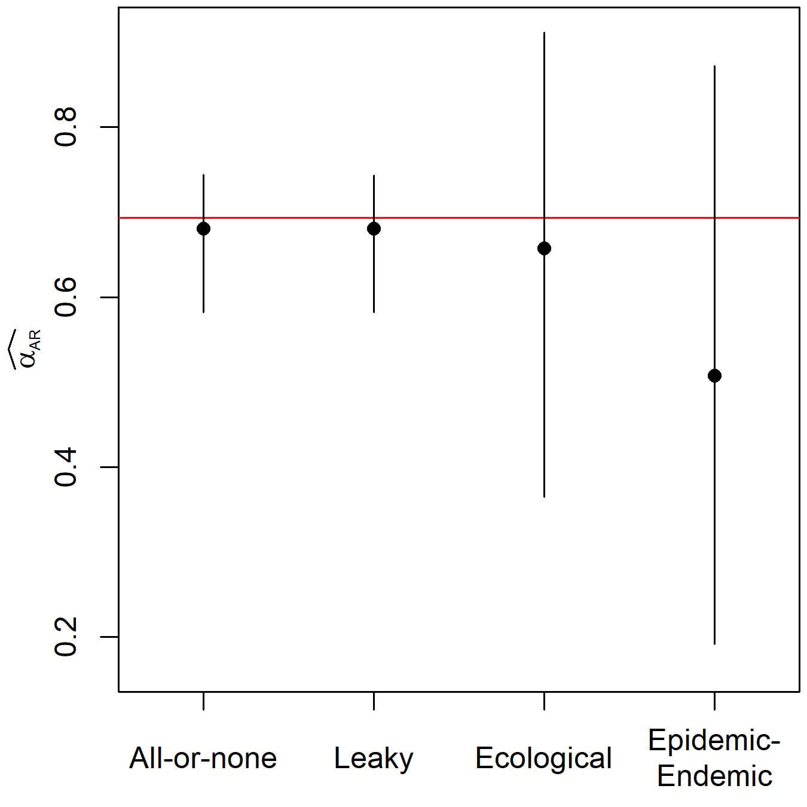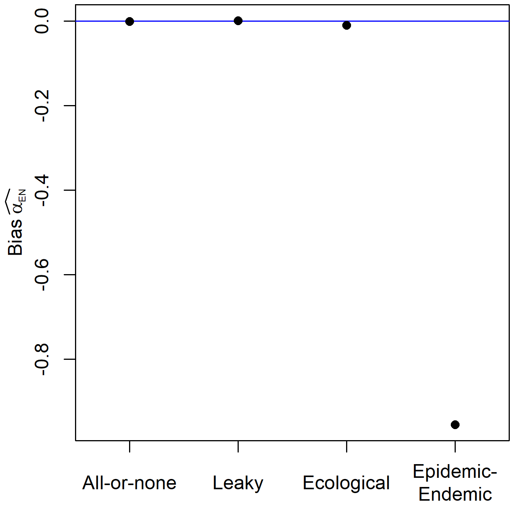


# Simulations to assess asymptotic behavior of ecological vaccine model


```r
Nsims=100
pmt=proc.time()
set.seed(47)
asym_sims=replicate(Nsims, sim.one(vacc='AoN', N=N, Nwks=52*20, alpha_ar=alpha_ar, alpha_en=alpha_en, phi=phi, x=x))
proc.time()-pmt
```

   user  system elapsed 
2696.47   66.32 2888.22 

```r
# 
```

Example of epidemic curve

```r
tmp=t(asym_sims['dat', 1]$dat$Y)
tmp[which(tmp==0)]=0.5
k=seq(0, dim(tmp)[1], by=52 )
matplot(tmp, type='l', col=pltcols,  ylab='Counts', xlab='Years', lty=1, log='y', yaxt='n', ylim=c(0.5, 150), xaxt='n')
axis(2, at=c(0.5, 1, 2, 5, c(1, 2, 5)*10, c(1, 2, 5)*1e2, c(1, 2, 5)*1e3, c(1, 2, 5)*1e4, c(1, 2, 5)*1e5), labels=c(0, 1, 2, 5, c(1, 2, 5)*10, c(1, 2, 5)*1e2, c(1, 2, 5)*1e3, c(1, 2, 5)*1e4, c(1, 2, 5)*1e5), las=2, cex.axis=0.75)
axis(1, at=k, labels=0:(length(k)-1))
legend('topleft', legend=c('R', round(exp(alpha_ar)*(1-phi*x), 2), 'x_i',  x), ncol=2, lty=c(rep(NA, 7), rep(1, 5)), col=c(rep(NA, 7), pltcols),  bty='n', cex=0.75)
mtext(side=3, text=bquote(paste(R[0], ' = ', .(exp(alpha_ar)), '  ', nu, ' = ', .(round(exp(alpha_en), 2)) , '  ', phi, ' = ', .(phi) ) ), at=Nwks/2, line=0)
```

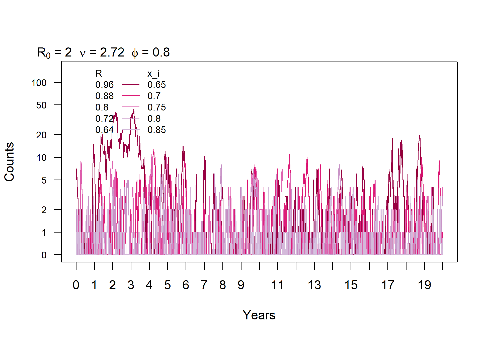<!-- -->

```r
# 
```

Simulation results

```r
mod1.ests=sapply(asym_sims['mod1', ], function(x){x$par})
mod1.se=sapply(asym_sims['mod1', ], function(x){sqrt(diag(solve(x$hessian)))})
table(sapply(asym_sims['mod1', ], function(x){x$convergence}))

mod2.ests=sapply(asym_sims['mod2', ], function(x){x$par})
mod2.se=sapply(asym_sims['mod2', ], function(x){sqrt(diag(solve(x$hessian)))})
table(sapply(asym_sims['mod2', ], function(x){x$convergence}))

mod3.ests=sapply(asym_sims['mod3', ], function(x){x$par})
mod3.se=sapply(asym_sims['mod3', ], function(x){sqrt(diag(solve(x$hessian)))})
table(sapply(asym_sims['mod3', ], function(x){x$convergence}))

mod4.ests=sapply(asym_sims['mod4', ], function(x){x$par})
mod4.se=sapply(asym_sims['mod4', ], function(x){sqrt(diag(solve(x$hessian)))})
table(sapply(asym_sims['mod4', ], function(x){x$convergence}))

par(mar=c(3, 3.1, 0, 0)+0.2)
plot(x=c(0.5, 4.5), y=c(-0.15, 0.75), type='n', xaxt='n', ylab='', xlab='', xaxs='i')
mtext(expression( widehat(alpha[scriptscriptstyle(AR)])), side=2, line=2)
# mtext('Models', side=1, line=2)
abline(h=alpha_ar, col='red')
axis(1, at=1:4, labels=c('All-or-none', 'Leaky', 'Ecological', 'Epidemic-\nEndemic'), padj=0.5)
points(x=c(1:4), y=c(mean(mod1.ests[1, ]), mean(mod2.ests[1, ]), mean(mod3.ests[1, ]),  mean(mod4.ests[1, ])), pch=16 )
segments(x0=1, x1=1, y0=mean(mod1.ests[1, ]-1.96*mod1.se[1, ]), y1=mean(mod1.ests[1, ]+1.96*mod1.se[1, ]))
segments(x0=2, x1=2, y0=mean(mod2.ests[1, ]-1.96*mod2.se[1, ]), y1=mean(mod2.ests[1, ]+1.96*mod2.se[1, ]))
segments(x0=3, x1=3, y0=mean(mod3.ests[1, ]-1.96*mod3.se[1, ]), y1=mean(mod3.ests[1, ]+1.96*mod3.se[1, ]))
segments(x0=4, x1=4, y0=mean(mod4.ests[1, ]-1.96*mod4.se[1, ]), y1=mean(mod4.ests[1, ]+1.96*mod4.se[1, ]))


plot(x=c(0.5, 4.5), y=c(0, 2.75), type='n', xaxt='n', ylab='', xlab='', xaxs='i')
mtext(expression( widehat(alpha[scriptscriptstyle(EN)])), side=2, line=2)
# mtext('Models', side=1, line=2)
abline(h=alpha_en, col='red')
axis(1, at=1:4, labels=c('All-or-none', 'Leaky', 'Ecological','Epidemic-\nEndemic'), padj=0.5)
points(x=c(1:4), y=c(mean(mod1.ests[2, ]), mean(mod2.ests[2, ]), mean(mod3.ests[2, ]),  mean(mod4.ests[2, ])), pch=16 )
segments(x0=1, x1=1, y0=mean(mod1.ests[2, ]-1.96*mod1.se[2, ]), y1=mean(mod1.ests[2, ]+1.96*mod1.se[2, ]))
segments(x0=2, x1=2, y0=mean(mod2.ests[2, ]-1.96*mod2.se[2, ]), y1=mean(mod2.ests[2, ]+1.96*mod2.se[2, ]))
segments(x0=3, x1=3, y0=mean(mod3.ests[2, ]-1.96*mod3.se[2, ]), y1=mean(mod3.ests[2, ]+1.96*mod3.se[2, ]))
segments(x0=4, x1=4, y0=mean(mod4.ests[2, ]-1.96*mod4.se[2, ]), y1=mean(mod4.ests[2, ]+1.96*mod4.se[2, ]))


plot(x=c(0.5, 3.5), y=c(0.25, 1.01), type='n', xaxt='n', ylab='', xlab='', xaxs='i')
mtext(expression(paste( widehat(phi))), side=2, line=2)
mtext('Models', side=1, line=2)

abline(h=phi, col='red')
axis(1, at=1:3, labels=c('All-or-none', 'Leaky', 'Ecological'))
points(x=c(1:3), y=c(mean(expit(mod1.ests[3, ])), mean(expit(mod2.ests[3, ])), mean(expit(mod3.ests[3, ]))), pch=16 )
segments(x0=1, x1=1, y0=mean(expit(mod1.ests[3, ]-1.96*mod1.se[3, ])), y1=mean(expit(mod1.ests[3, ]+1.96*mod1.se[3, ])))
segments(x0=2, x1=2, y0=mean(expit(mod2.ests[3, ]-1.96*mod2.se[3, ])), y1=mean(expit(mod2.ests[3, ]+1.96*mod2.se[3, ])))
segments(x0=3, x1=3, y0=mean(expit(mod3.ests[3, ]-1.96*mod3.se[3, ])), y1=mean(expit(mod3.ests[3, ]+1.96*mod3.se[3, ])))
```


```r
vals=c(alpha_ar, alpha_en, phi)

res_asym = plyr::ldply(1:4, function(i){
        m = paste0('mod', i)
        
        est=sapply(asym_sims[m, ], function(x){c(x$par[1:2], expit(x$par[3]))})
        ests = rowMeans(est)
        percentiles = apply(est, 1, function(x){quantile(x, c(0.025, 0.975))})
        se.ests = apply(est, 1, sd)
        
        bias = rowMeans(apply(est, 2, function(x){(x - vals)}))
        mse = rowMeans(apply(est, 2, function(x){(x - vals)^2}))
        c(mod = i, Est.ar = ests[1],  pct.025.ar = as.numeric(percentiles[1, 1]), pct.975.ar = as.numeric(percentiles[2, 1]),  Bias.ar = bias[1], MSE.ar = mse[1], 
          Est.en = ests[2], pct.025.en = as.numeric(percentiles[1, 2]), pct.975.en = as.numeric(percentiles[2, 2]), Bias.en = bias[2], MSE.en = mse[2],
          Est.phi = ests[3], pct.025.phi = as.numeric(percentiles[1, 3]), pct.975.phi = as.numeric(percentiles[2, 3]), Bias.phi = bias[3], MSE.phi = mse[3])
        
})


par(mar=c(3, 3.1, 0, 0)+0.2)

## Plot Estimates
plot(x=c(0.5, 4.5), y=rng.est.ar, type='n', xaxt='n', ylab='', xlab='', xaxs='i')
mtext(expression( widehat(alpha[scriptscriptstyle(AR)])), side=2, line=2)
abline(h=alpha_ar, col='red')
axis(1, at=1:4, labels=c('All-or-none', 'Leaky', 'Ecological', 'Epidemic-\nEndemic'), padj=0.5)
points(x=1:4, y=res_asym$Est.ar, pch=16)
for(i in 1:4){
        segments(x0=i, x1=i, y0=res_asym$pct.025.ar[i], y1=res_asym$pct.975.ar[i])
}

plot(x=c(0.5, 4.5), y=rng.est.en, type='n', xaxt='n', ylab='', xlab='', xaxs='i')
mtext(expression( widehat(alpha[scriptscriptstyle(EN)])), side=2, line=2)
abline(h=alpha_en, col='red')
axis(1, at=1:4, labels=c('All-or-none', 'Leaky', 'Ecological', 'Epidemic-\nEndemic'), padj=0.5)
points(x=1:4, y=res_asym$Est.en, pch=16)
for(i in 1:4){
        segments(x0=i, x1=i, y0=res_asym$pct.025.en[i], y1=res_asym$pct.975.en[i])
}


plot(x=c(0.5, 3.5), y=rng.est.phi, type='n', xaxt='n', ylab='', xlab='', xaxs='i')
mtext(expression(paste( widehat(phi))), side=2, line=2)
abline(h=phi, col='red')
axis(1, at=1:3, labels=c('All-or-none', 'Leaky', 'Ecological'))
points(x=1:3, y=res_asym$Est.phi[1:3], pch=16)
for(i in 1:3){
        segments(x0=i, x1=i, y0=res_asym$pct.025.phi[i], y1=res_asym$pct.975.phi[i])
}


## Plot bias of estimates
rng = with(res_asym, range(Bias.ar, Bias.en, Bias.phi, 0))

rng.ar = range(res_asym$Bias.ar, 0)
par(mar=c(3, 3.1, 0, 0)+0.2)
plot(x=c(0.5, 4.5), y=rng.ar, type='n', xaxt='n', ylab='', xlab='', xaxs='i')
mtext(expression(Bias~ widehat(alpha[scriptscriptstyle(AR)])), side=2, line=2)
abline(h=0, col='blue')
axis(1, at=1:4, labels=c('All-or-none', 'Leaky', 'Ecological', 'Epidemic-\nEndemic'), padj=0.5)
points(x=c(1:4), y=res_asym$Bias.ar, pch=16 )

rng.en = range(res_asym$Bias.en, 0)
plot(x=c(0.5, 4.5), y=rng.en, type='n', xaxt='n', ylab='', xlab='', xaxs='i')
mtext(expression(Bias~widehat(alpha[scriptscriptstyle(EN)])), side=2, line=2)
abline(h=0, col='blue')
axis(1, at=1:4, labels=c('All-or-none', 'Leaky', 'Ecological', 'Epidemic-\nEndemic'), padj=0.5)
points(x=1:4, y=res_asym$Bias.en, pch=16 )

rng.phi = range(res_asym$Bias.phi[1:3], 0)
plot(x=c(0.5, 3.5), y=rng.phi, type='n', xaxt='n', ylab='', xlab='', xaxs='i')
mtext(expression(Bias~paste( widehat(phi))), side=2, line=2)
abline(h=0, col='blue')
axis(1, at=1:3, labels=c('All-or-none', 'Leaky', 'Ecological'))
points(x=1:3, y=res_asym$Bias.phi[1:3], pch=16 )

## Plot MSE of estimates
rng = with(res_asym, range(MSE.ar, MSE.en, MSE.phi, 0))

rng.ar = range(res_asym$MSE.ar, 0)
par(mar=c(3, 3.1, 0, 0)+0.2)
plot(x=c(0.5, 4.5), y=rng.ar, type='n', xaxt='n', ylab='', xlab='', xaxs='i')
mtext(expression(MSE~ widehat(alpha[scriptscriptstyle(AR)])), side=2, line=2)
abline(h=0, col='blue')
axis(1, at=1:4, labels=c('All-or-none', 'Leaky', 'Ecological', 'Epidemic-\nEndemic'), padj=0.5)
points(x=c(1:4), y=res_asym$MSE.ar, pch=16 )

rng.en = range(res_asym$MSE.en, 0)
plot(x=c(0.5, 4.5), y=rng.en, type='n', xaxt='n', ylab='', xlab='', xaxs='i')
mtext(expression(MSE~widehat(alpha[scriptscriptstyle(EN)])), side=2, line=2)
abline(h=0, col='blue')
axis(1, at=1:4, labels=c('All-or-none', 'Leaky', 'Ecological', 'Epidemic-\nEndemic'), padj=0.5)
points(x=1:4, y=res_asym$MSE.en, pch=16 )

rng.phi = range(res_asym$MSE.phi[1:3], 0)
plot(x=c(0.5, 3.5), y=rng.phi, type='n', xaxt='n', ylab='', xlab='', xaxs='i')
mtext(expression(MSE~paste( widehat(phi))), side=2, line=2)
abline(h=0, col='blue')
axis(1, at=1:3, labels=c('All-or-none', 'Leaky', 'Ecological'))
points(x=1:3, y=res_asym$MSE.phi[1:3], pch=16 )


# Table of Estimates
# kable(res_asym, caption=paste('Summary of parameter estimates from', Nsims, 'simulations, where alpha_ar =', exp(alpha_ar), 'alpha_en =', alpha_en, 'and a leaky vaccine effect of', phi ))

kable(cbind(c('All-or-none', 'Leaky', 'Ecological', 'Epidemic-Endemic'), res_asym[, -1]),
      caption=paste('Summary of parameter estimates from', Nsims, 'simulations, where alpha_ar =', round(alpha_ar, 3), 'alpha_en =', alpha_en, 'and a leaky vaccine effect of', phi ), 
      digits=3, col.names=c('Model', 'Est AR', '2.5% AR', '97.5% AR', 'Bias AR', 'MSE AR', 'Est EN', '2.5% EN', '97.5% EN', 'Bias EN', 'MSE EN', 'Est Phi', '2.5% Phi', '97.5% Phi', 'Bias Phi', 'MSE Phi')
      )
```


Table: Summary of parameter estimates from 100 simulations, where alpha_ar = 0.693 alpha_en = 1 and a leaky vaccine effect of 0.8

Model               Est AR   2.5% AR   97.5% AR   Bias AR   MSE AR   Est EN   2.5% EN   97.5% EN   Bias EN   MSE EN   Est Phi   2.5% Phi   97.5% Phi   Bias Phi   MSE Phi
-----------------  -------  --------  ---------  --------  -------  -------  --------  ---------  --------  -------  --------  ---------  ----------  ---------  --------
All-or-none          0.692     0.653      0.717    -0.001    0.000    1.007     0.922      1.088     0.007    0.002     0.800      0.791       0.810      0.000     0.000
Leaky                0.692     0.653      0.716    -0.001    0.000    1.011     0.927      1.093     0.011    0.002     0.804      0.794       0.814      0.004     0.000
Ecological           0.614     0.523      0.718    -0.079    0.009    0.927     0.769      1.089    -0.073    0.012     0.767      0.698       0.835     -0.033     0.002
Epidemic-Endemic     0.449     0.337      0.597    -0.244    0.064    0.041    -0.033      0.123    -0.959    0.922     0.621      0.598       0.650     -0.179     0.032

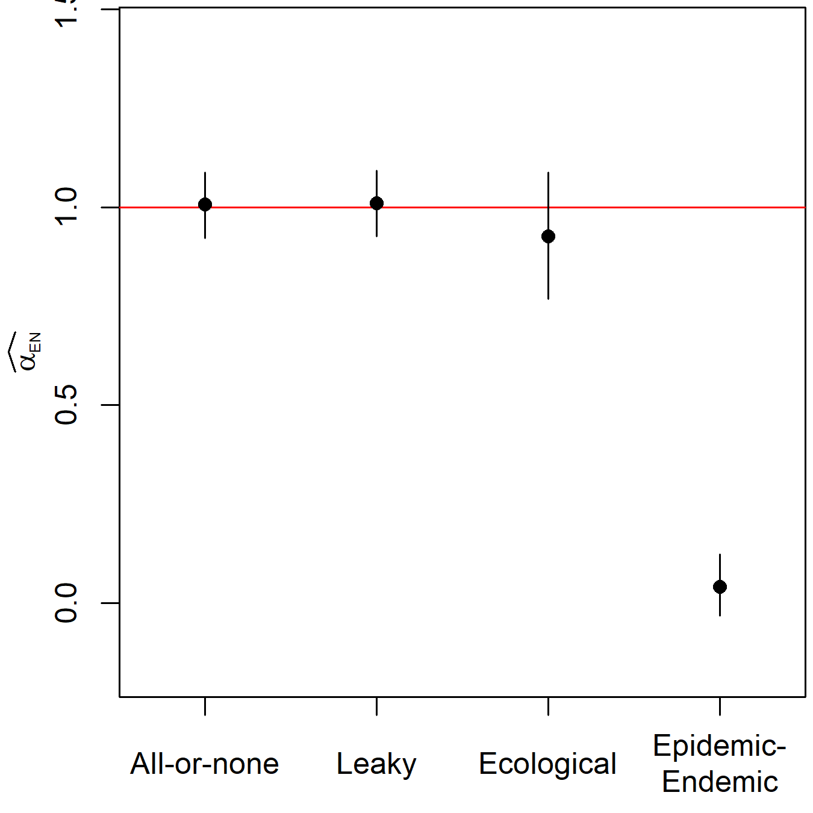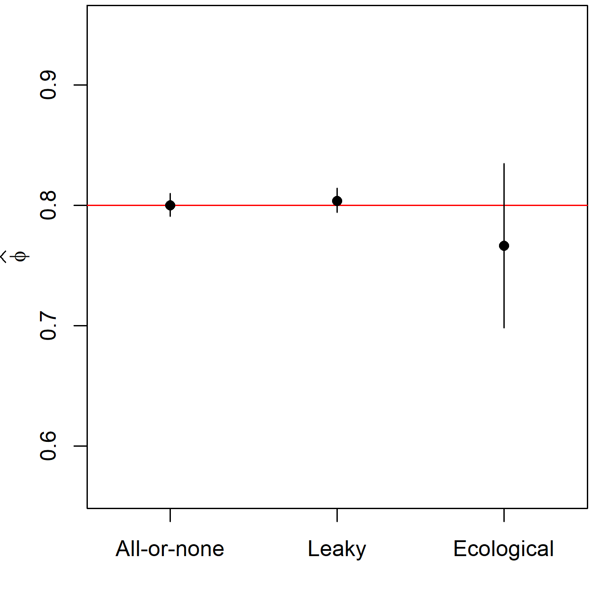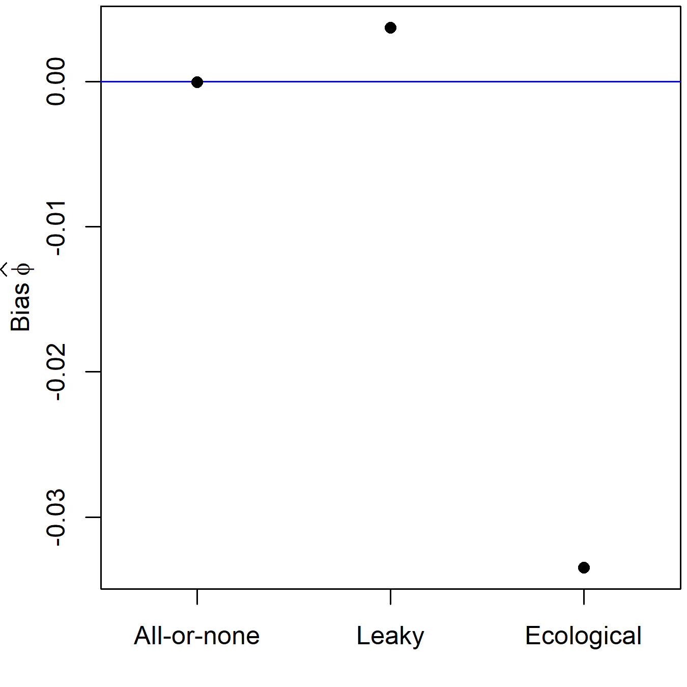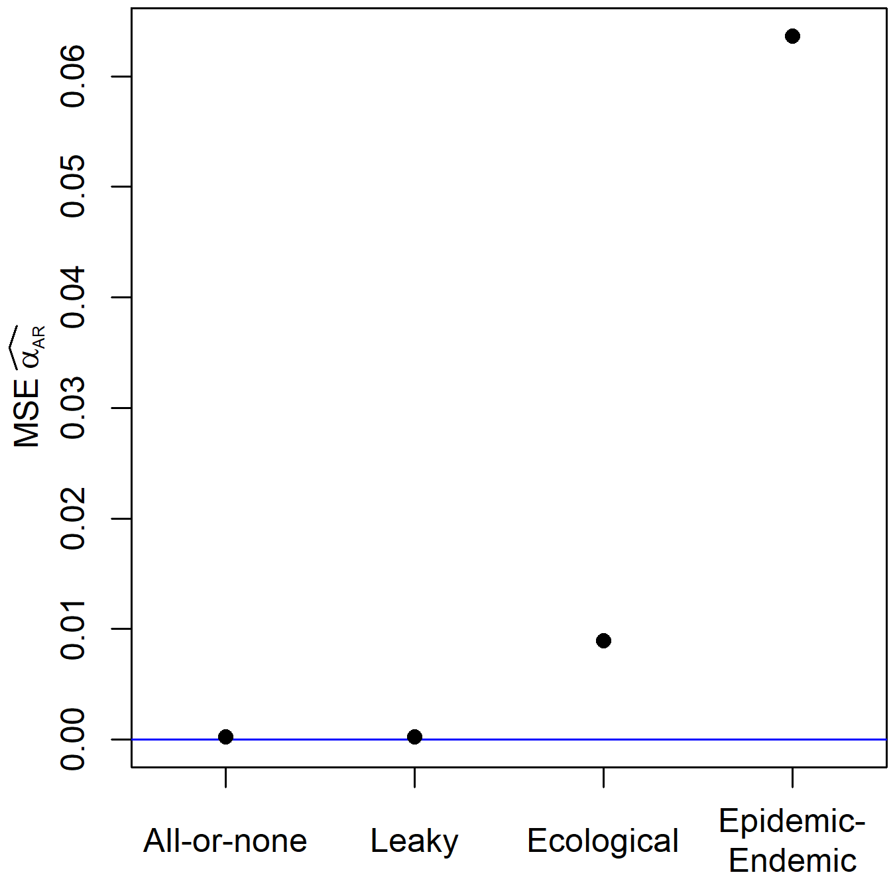

